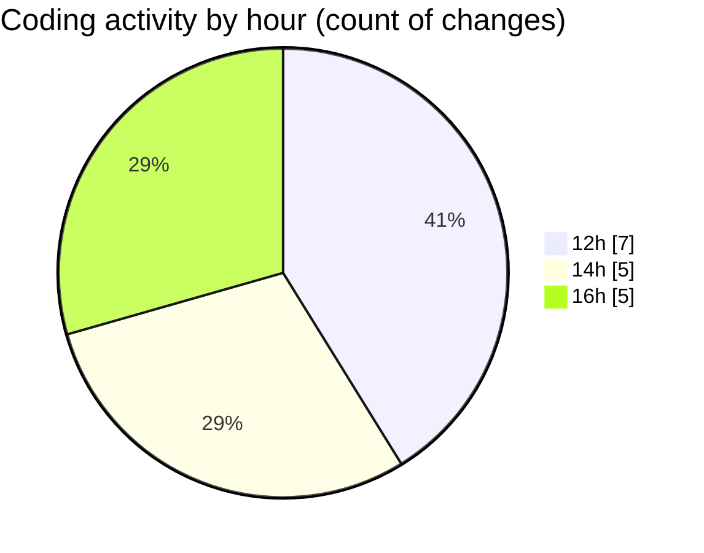

# eventscop-frontend-guide (Workspace) - Activity Summary 

## Overall Statistics

| Stat                   | Value                                                             |
| ---------------------- | ----------------------------------------------------------------- |
| **Lines Added** (➕)   | 1574                                          |
| **Lines Removed** (➖) | 3                                        |
| **Net Change** (↕)    | 1571                |
| **Active Time** (⌚)   | 18 minutes |

## Modified Files
- **entries.json** (+1, -0)
- **history_vscode.py** (+186, -2)
- **page.tsx** (+453, -0)
- **page.tsx** (+223, -0)
- **page.tsx** (+461, -0)
- **searchHelpers.ts** (+250, -1)

## Visualizations

### By File Type (Lines Changed)

### By Hour (Estimated Activity Count)

> **Last Updated:** 10/6/2025, 4:27:14 PM