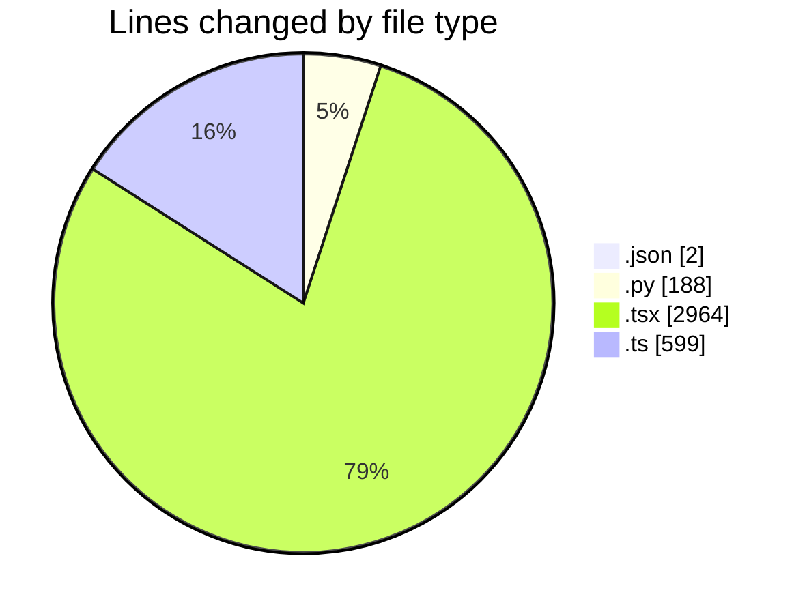
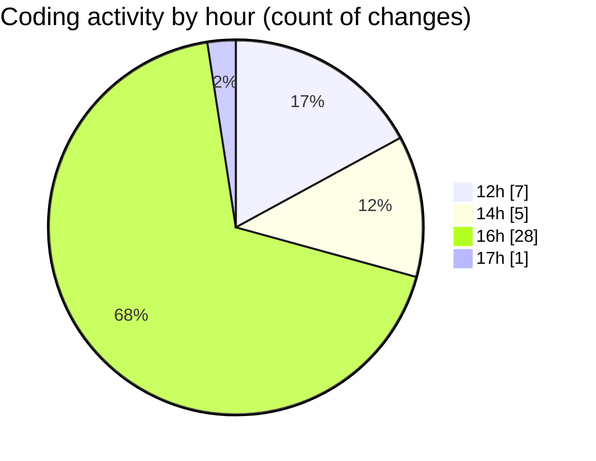

# eventscop-frontend-guide (Workspace) - Activity Summary 

## Overall Statistics

| Stat                   | Value                                                             |
| ---------------------- | ----------------------------------------------------------------- |
| **Lines Added** (➕)   | 3676                                          |
| **Lines Removed** (➖) | 77                                        |
| **Net Change** (↕)    | 3599                |
| **Active Time** (⌚)   | 51 minutes |

## Modified Files
- **entries.json** (+1, -0)
- **history_vscode.py** (+186, -2)
- **page.tsx** (+458, -22)
- **page.tsx** (+223, -0)
- **page.tsx** (+461, -0)
- **searchHelpers.ts** (+250, -4)
- **routing.ts** (+193, -0)
- **page.tsx** (+314, -23)
- **page.tsx** (+325, -26)
- **package.json** (+1, -0)
- **page.tsx** (+327, -0)
- **DesktopSearchForm.tsx** (+165, -0)
- **SliderCards.tsx** (+108, -0)
- **ComparisonActionsCell.tsx** (+49, -0)
- **BreatheRightSection.tsx** (+42, -0)
- **loading.tsx** (+39, -0)
- **DynamicField.tsx** (+57, -0)
- **FormTypeTabs.tsx** (+36, -0)
- **HorizontalPlaceCard.tsx** (+37, -0)
- **ActivityCard.tsx** (+157, -0)
- **PriceBlock.tsx** (+40, -0)
- **tabs.tsx** (+55, -0)
- **reviews.ts** (+152, -0)

## Visualizations

### By File Type (Lines Changed)

### By Hour (Estimated Activity Count)

> **Last Updated:** 10/6/2025, 5:02:15 PM