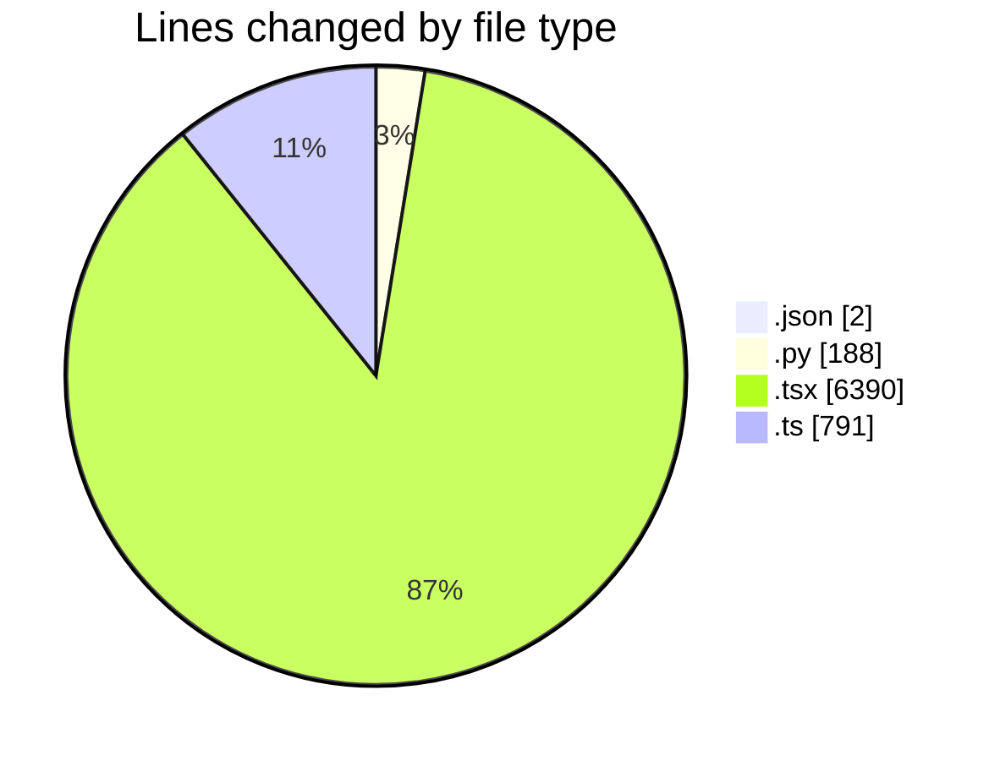
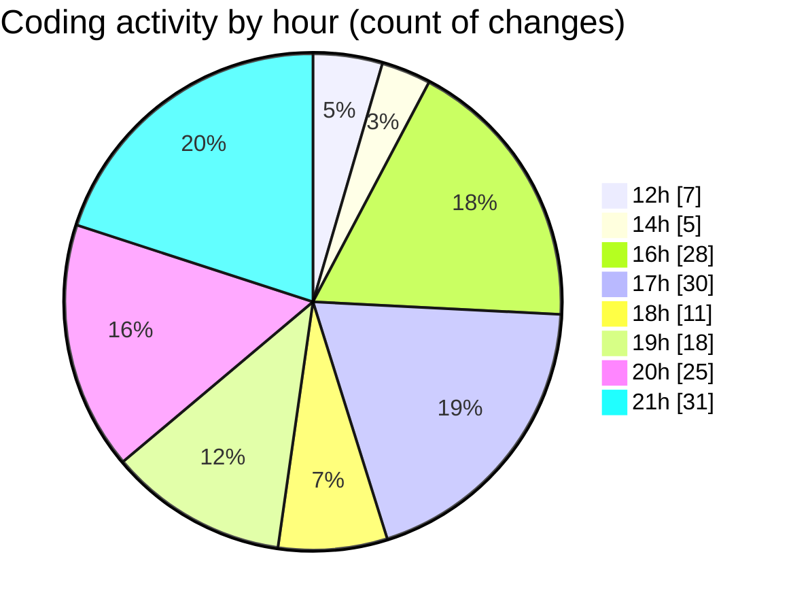

# eventscop-frontend-guide (Workspace) - Activity Summary 

## Overall Statistics

| Stat                   | Value                                                             |
| ---------------------- | ----------------------------------------------------------------- |
| **Lines Added** (➕)   | 6880                                          |
| **Lines Removed** (➖) | 491                                        |
| **Net Change** (↕)    | 6389                |
| **Active Time** (⌚)   | 221 minutes |

## Modified Files
- **entries.json** (+1, -0)
- **history_vscode.py** (+186, -2)
- **page.tsx** (+458, -22)
- **page.tsx** (+223, -0)
- **page.tsx** (+461, -0)
- **searchHelpers.ts** (+250, -4)
- **routing.ts** (+201, -3)
- **page.tsx** (+314, -23)
- **page.tsx** (+325, -26)
- **package.json** (+1, -0)
- **page.tsx** (+384, -60)
- **DesktopSearchForm.tsx** (+165, -0)
- **SliderCards.tsx** (+108, -0)
- **ComparisonActionsCell.tsx** (+49, -0)
- **BreatheRightSection.tsx** (+42, -0)
- **loading.tsx** (+39, -0)
- **DynamicField.tsx** (+57, -0)
- **FormTypeTabs.tsx** (+36, -0)
- **HorizontalPlaceCard.tsx** (+37, -0)
- **ActivityCard.tsx** (+157, -0)
- **PriceBlock.tsx** (+40, -0)
- **tabs.tsx** (+55, -0)
- **reviews.ts** (+166, -0)
- **cache-tags.ts** (+26, -0)
- **cache.ts** (+140, -0)
- **ClientPresearchSection.tsx** (+96, -6)
- **PresearchSectionWrapper.tsx** (+104, -3)
- **PresearchResults.tsx** (+76, -6)
- **Discover.tsx** (+96, -4)
- **page.tsx** (+382, -75)
- **page.tsx** (+321, -51)
- **components.ts** (+1, -0)
- **components.tsx** (+57, -0)
- **page.tsx** (+93, -1)
- **page.tsx** (+285, -27)
- **page.tsx** (+52, -0)
- **page.tsx** (+106, -21)
- **page.tsx** (+1110, -65)
- **components.tsx** (+111, -92)
- **ImageWithOverlay.tsx** (+69, -0)

## Visualizations

### By File Type (Lines Changed)

### By Hour (Estimated Activity Count)

> **Last Updated:** 10/6/2025, 9:32:15 PM