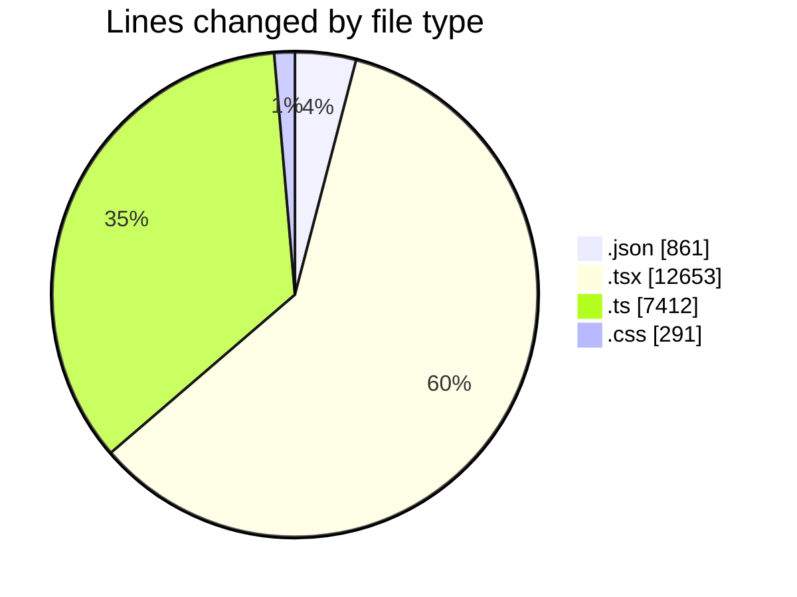
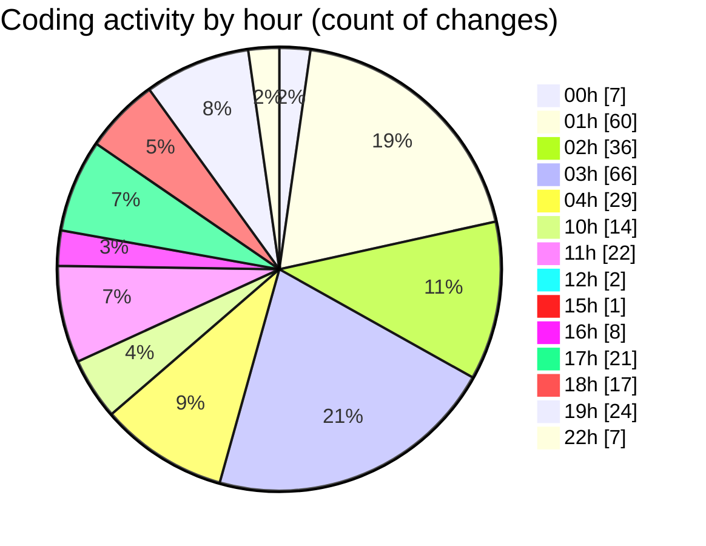

# eventscop-frontend-guide (Workspace) - Activity Summary 

## Overall Statistics

| Stat                   | Value                                                             |
| ---------------------- | ----------------------------------------------------------------- |
| **Lines Added** (➕)   | 20242                                          |
| **Lines Removed** (➖) | 975                                        |
| **Net Change** (↕)    | 19267                |
| **Active Time** (⌚)   | 425 minutes |

## Modified Files
- **settings.json** (+585, -0)
- **package.json** (+3, -2)
- **EventCard.tsx** (+75, -1)
- **page.tsx** (+855, -2)
- **routing.ts** (+432, -30)
- **page.tsx** (+60, -6)
- **page.ts** (+85, -0)
- **page.ts** (+85, -0)
- **page.ts** (+85, -0)
- **page.ts** (+85, -0)
- **page.ts** (+85, -0)
- **page.ts** (+85, -0)
- **page.ts** (+85, -0)
- **page.ts** (+85, -0)
- **page.ts** (+85, -0)
- **page.ts** (+85, -0)
- **page.tsx** (+857, -5)
- **page.tsx** (+86, -0)
- **components.tsx** (+57, -0)
- **List.tsx** (+57, -2)
- **page.tsx** (+271, -0)
- **globals.css** (+237, -54)
- **BreatheLeftSection.tsx** (+54, -20)
- **page.tsx** (+254, -0)
- **ImageWithOverlay.tsx** (+134, -66)
- **page.tsx** (+324, -0)
- **page.tsx** (+79, -0)
- **page.tsx** (+80, -0)
- **page.tsx** (+92, -0)
- **page.tsx** (+89, -0)
- **page.tsx** (+70, -0)
- **ImageWithOverlay.tsx** (+69, -0)
- **page.tsx** (+403, -0)
- **page.tsx** (+252, -0)
- **page.tsx** (+101, -0)
- **page.tsx** (+107, -0)
- **page.tsx** (+115, -0)
- **InfoCard.tsx** (+16, -0)
- **Card.tsx** (+25, -0)
- **page.tsx** (+265, -0)
- **page.tsx** (+461, -0)
- **page.tsx** (+848, -0)
- **PostalCodeTags.tsx** (+100, -0)
- **BreatheSection.tsx** (+15, -1)
- **FiltrePopup.tsx** (+62, -4)
- **HeroTitleBase.tsx** (+218, -120)
- **urls.ts** (+93, -10)
- **navigation.ts** (+63, -9)
- **supplier-chains.ts** (+29, -0)
- **supplier.ts** (+609, -0)
- **locations.ts** (+9, -8)
- **route.ts** (+181, -45)
- **LocationTypeIcon.tsx** (+39, -2)
- **cities.ts** (+98, -44)
- **CityAutocomplete.tsx** (+246, -0)
- **searchHelpers.ts** (+322, -64)
- **page.tsx** (+321, -35)
- **TruncatedText.tsx** (+270, -113)
- **page.tsx** (+320, -21)
- **page.tsx** (+406, -109)
- **page.tsx** (+285, -55)
- **page.tsx** (+219, -0)
- **event-types.ts** (+25, -0)
- **CityInputWithRadius.tsx** (+466, -1)
- **TagSelector.tsx** (+207, -22)
- **brief.ts** (+1620, -0)
- **brief.ts** (+454, -16)
- **CateringFormFields.tsx** (+262, -14)
- **.claude.json** (+157, -26)
- **settings.local.json** (+56, -0)
- **.mcp.json** (+32, -0)
- **LocationTabsContent.tsx** (+327, -0)
- **StepLocation.tsx** (+208, -0)
- **MeetingHallItem.tsx** (+400, -17)
- **ActivityMapAccessDescription.tsx** (+272, -11)
- **RadiusSelector.tsx** (+84, -1)
- **departments.ts** (+1854, -24)
- **FranceMapReadOnly.tsx** (+93, -6)
- **page.tsx** (+393, -9)
- **track-visit.ts** (+51, -0)
- **ActivityPresentationSection.tsx** (+29, -0)
- **ActivityCapacityBrief.tsx** (+77, -0)
- **page.tsx** (+535, -0)
- **filters.ts** (+472, -0)

## Visualizations

### By File Type (Lines Changed)

### By Hour (Estimated Activity Count)

> **Last Updated:** 10/7/2025, 10:47:08 PM