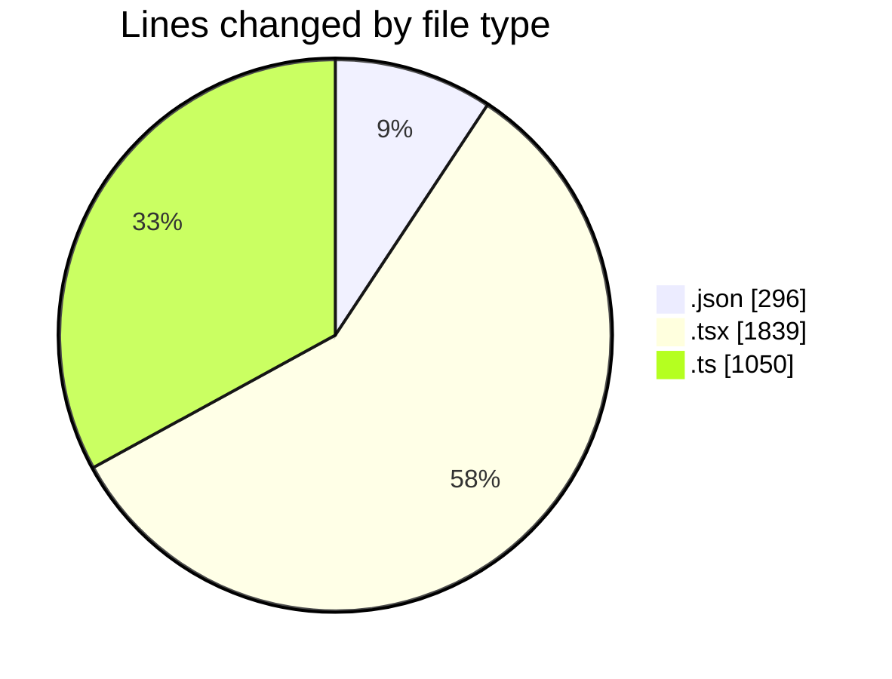
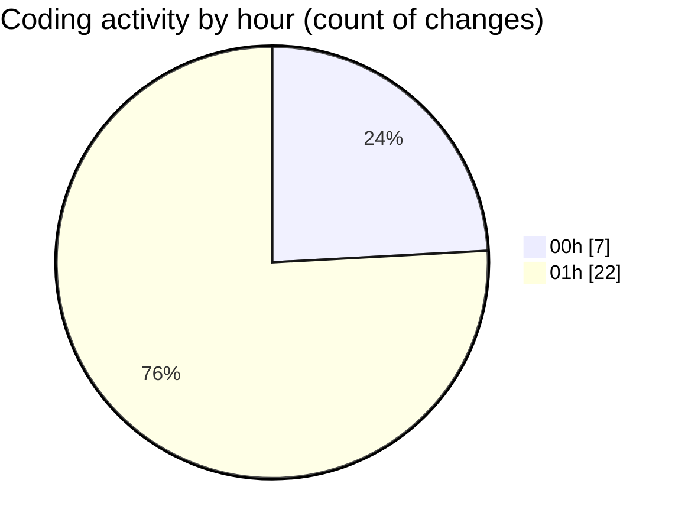

# eventscop-frontend-guide (Workspace) - Activity Summary 

## Overall Statistics

| Stat                   | Value                                                             |
| ---------------------- | ----------------------------------------------------------------- |
| **Lines Added** (➕)   | 3178                                          |
| **Lines Removed** (➖) | 7                                        |
| **Net Change** (↕)    | 3171                |
| **Active Time** (⌚)   | 52 minutes |

## Modified Files
- **settings.json** (+291, -0)
- **package.json** (+3, -2)
- **EventCard.tsx** (+75, -1)
- **page.tsx** (+855, -2)
- **routing.ts** (+198, -2)
- **page.tsx** (+53, -0)
- **page.ts** (+85, -0)
- **page.ts** (+85, -0)
- **page.ts** (+85, -0)
- **page.ts** (+85, -0)
- **page.ts** (+85, -0)
- **page.ts** (+85, -0)
- **page.ts** (+85, -0)
- **page.ts** (+85, -0)
- **page.ts** (+85, -0)
- **page.ts** (+85, -0)
- **page.tsx** (+853, -0)

## Visualizations

### By File Type (Lines Changed)

### By Hour (Estimated Activity Count)

> **Last Updated:** 10/7/2025, 1:30:35 AM