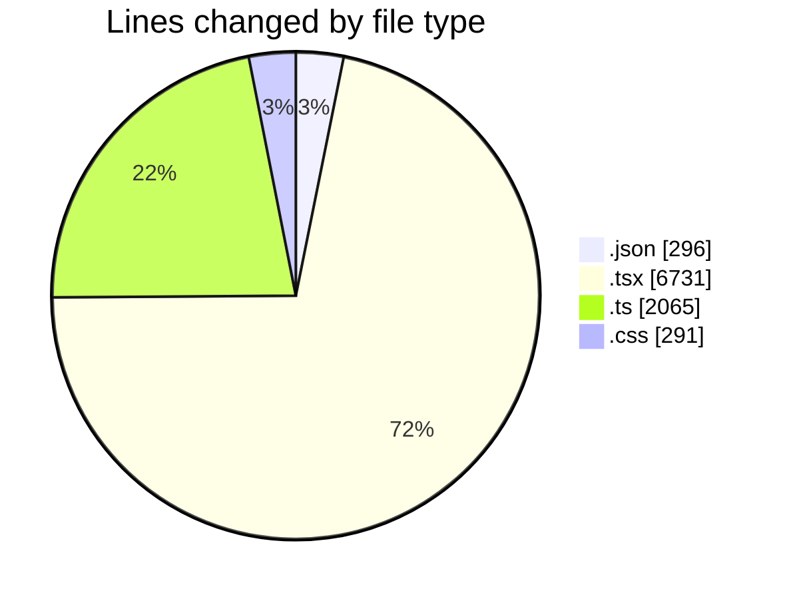
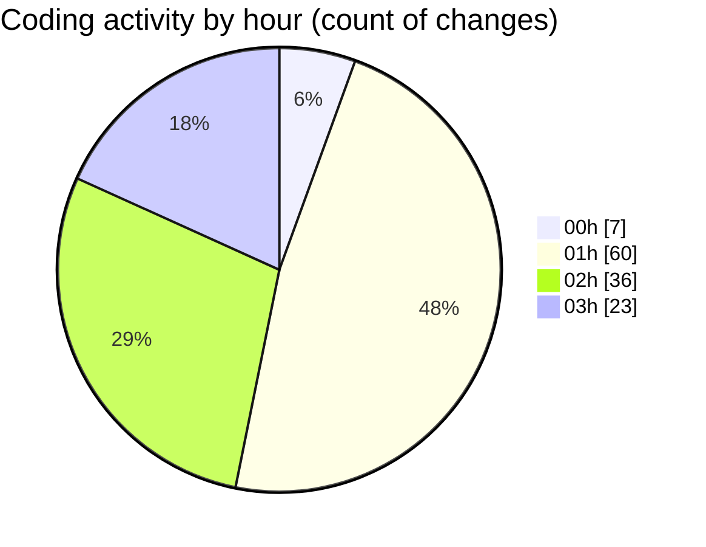

# eventscop-frontend-guide (Workspace) - Activity Summary 

## Overall Statistics

| Stat                   | Value                                                             |
| ---------------------- | ----------------------------------------------------------------- |
| **Lines Added** (➕)   | 9106                                          |
| **Lines Removed** (➖) | 277                                        |
| **Net Change** (↕)    | 8829                |
| **Active Time** (⌚)   | 159 minutes |

## Modified Files
- **settings.json** (+291, -0)
- **package.json** (+3, -2)
- **EventCard.tsx** (+75, -1)
- **page.tsx** (+855, -2)
- **routing.ts** (+198, -2)
- **page.tsx** (+54, -4)
- **page.ts** (+85, -0)
- **page.ts** (+85, -0)
- **page.ts** (+85, -0)
- **page.ts** (+85, -0)
- **page.ts** (+85, -0)
- **page.ts** (+85, -0)
- **page.ts** (+85, -0)
- **page.ts** (+85, -0)
- **page.ts** (+85, -0)
- **page.ts** (+85, -0)
- **page.tsx** (+853, -1)
- **page.tsx** (+81, -0)
- **components.tsx** (+57, -0)
- **List.tsx** (+57, -2)
- **page.tsx** (+271, -0)
- **globals.css** (+237, -54)
- **BreatheLeftSection.tsx** (+40, -11)
- **page.tsx** (+254, -0)
- **ImageWithOverlay.tsx** (+134, -66)
- **page.tsx** (+324, -0)
- **page.tsx** (+79, -0)
- **page.tsx** (+80, -0)
- **page.tsx** (+92, -0)
- **page.tsx** (+89, -0)
- **page.tsx** (+70, -0)
- **ImageWithOverlay.tsx** (+69, -0)
- **page.tsx** (+403, -0)
- **page.tsx** (+252, -0)
- **page.tsx** (+101, -0)
- **page.tsx** (+107, -0)
- **page.tsx** (+115, -0)
- **InfoCard.tsx** (+16, -0)
- **Card.tsx** (+25, -0)
- **page.tsx** (+265, -0)
- **page.tsx** (+461, -0)
- **page.tsx** (+848, -0)
- **PostalCodeTags.tsx** (+100, -0)
- **BreatheSection.tsx** (+15, -1)
- **FiltrePopup.tsx** (+62, -4)
- **HeroTitleBase.tsx** (+197, -100)
- **urls.ts** (+91, -10)
- **navigation.ts** (+63, -8)
- **supplier-chains.ts** (+27, -0)
- **supplier.ts** (+609, -0)
- **locations.ts** (+9, -8)
- **route.ts** (+133, -1)
- **LocationTypeIcon.tsx** (+38, -0)
- **cities.ts** (+56, -0)

## Visualizations

### By File Type (Lines Changed)

### By Hour (Estimated Activity Count)

> **Last Updated:** 10/7/2025, 3:15:35 AM