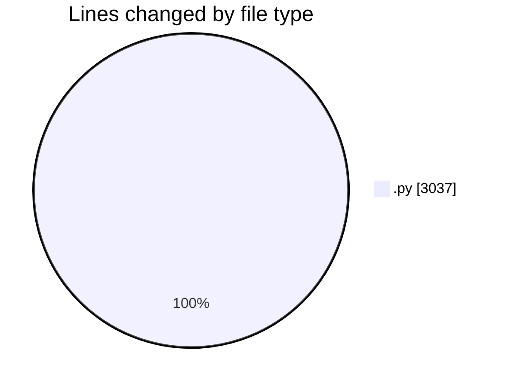
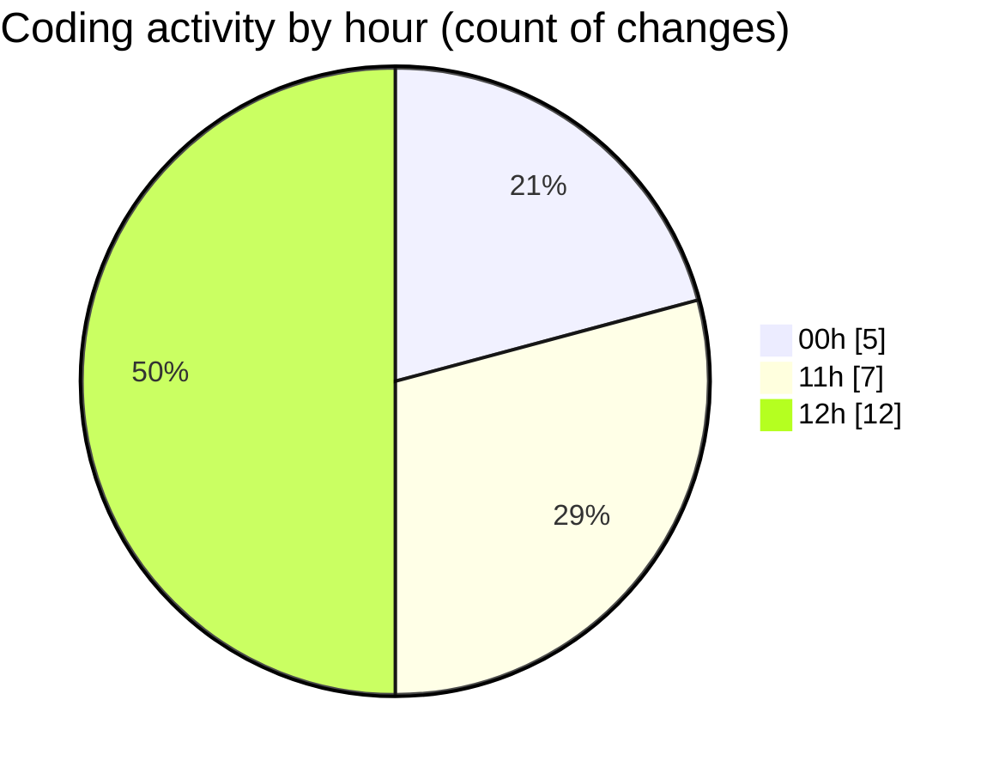

# eventscop-api-guide (Workspace) - Activity Summary 

## Overall Statistics

| Stat                   | Value                                                             |
| ---------------------- | ----------------------------------------------------------------- |
| **Lines Added** (➕)   | 2993                                          |
| **Lines Removed** (➖) | 44                                        |
| **Net Change** (↕)    | 2949                |
| **Active Time** (⌚)   | 39 minutes |

## Modified Files
- **activity_search_engine.py** (+478, -9)
- **search_engine.py** (+929, -34)
- **EntityAddress.py** (+47, -0)
- **SupplierSupplierCategory.py** (+39, -0)
- **SupplierCategory.py** (+30, -0)
- **routes.py** (+880, -0)
- **routes_card.py** (+590, -1)

## Visualizations

### By File Type (Lines Changed)

### By Hour (Estimated Activity Count)

> **Last Updated:** 10/8/2025, 12:16:04 PM