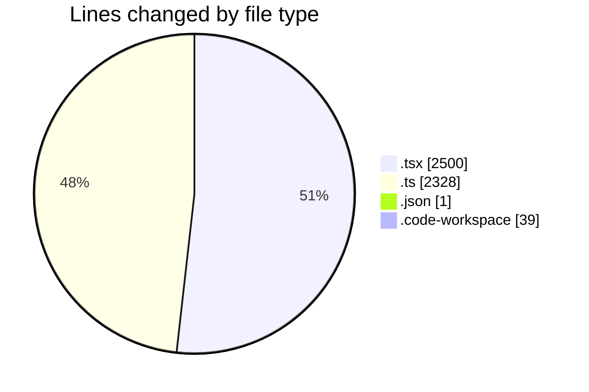
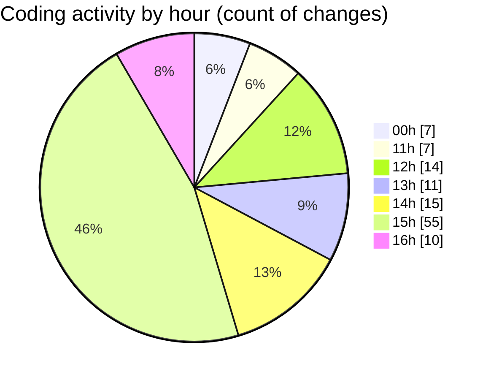

# eventscop-frontend-guide (Workspace) - Activity Summary 

## Overall Statistics

| Stat                   | Value                                                             |
| ---------------------- | ----------------------------------------------------------------- |
| **Lines Added** (➕)   | 4439                                          |
| **Lines Removed** (➖) | 429                                        |
| **Net Change** (↕)    | 4010                |
| **Active Time** (⌚)   | 182 minutes |

## Modified Files
- **page.tsx** (+254, -87)
- **utils-client.ts** (+232, -13)
- **ActivityPresentationSection.tsx** (+67, -3)
- **package.json** (+1, -0)
- **CityInputWithRadius.tsx** (+254, -59)
- **LocationTabsContent.tsx** (+363, -25)
- **cities.ts** (+66, -1)
- **ActivityMapAccessDescription.tsx** (+79, -15)
- **page.tsx** (+446, -131)
- **supplier-categories.ts** (+105, -0)
- **page.tsx** (+299, -4)
- **page.tsx** (+295, -15)
- **url-mapping.ts** (+513, -37)
- **searchHelpers.ts** (+268, -10)
- **filters.ts** (+482, -0)
- **activity.ts** (+94, -0)
- **eventscop-frontend-guide.code-workspace** (+39, -0)
- **supplier-activities.ts** (+479, -28)
- **ActivityCapacityBrief.tsx** (+103, -1)

## Visualizations

### By File Type (Lines Changed)

### By Hour (Estimated Activity Count)

> **Last Updated:** 10/8/2025, 4:39:32 PM