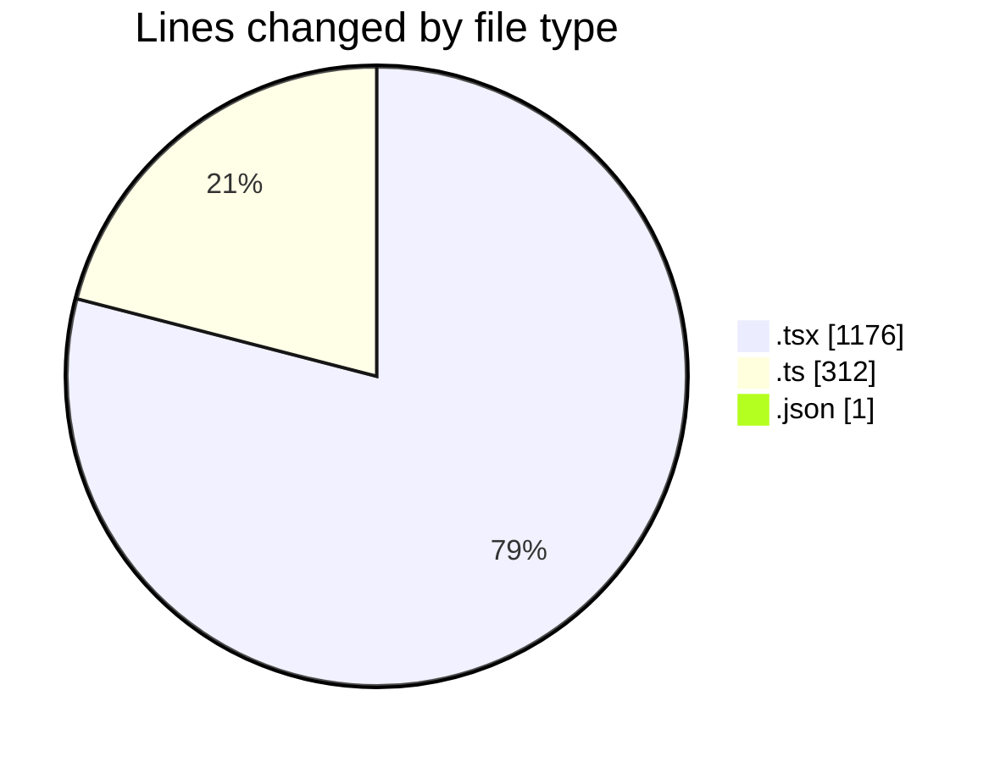
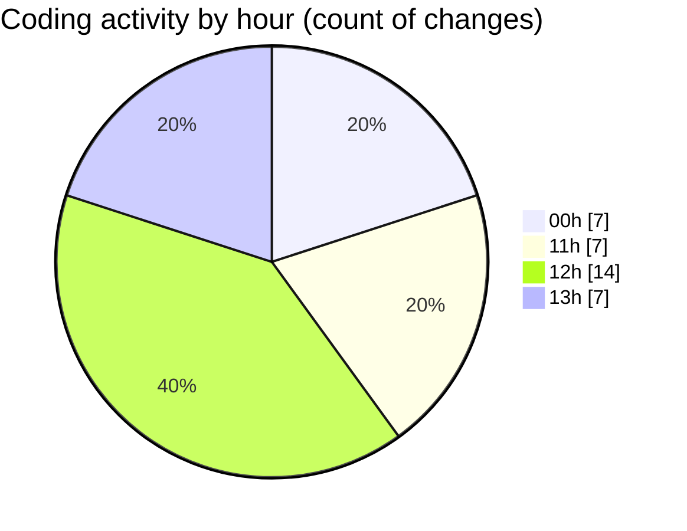

# eventscop-frontend-guide (Workspace) - Activity Summary 

## Overall Statistics

| Stat                   | Value                                                             |
| ---------------------- | ----------------------------------------------------------------- |
| **Lines Added** (➕)   | 1461                                          |
| **Lines Removed** (➖) | 28                                        |
| **Net Change** (↕)    | 1433                |
| **Active Time** (⌚)   | 45 minutes |

## Modified Files
- **page.tsx** (+193, -0)
- **utils-client.ts** (+232, -13)
- **ActivityPresentationSection.tsx** (+32, -0)
- **package.json** (+1, -0)
- **CityInputWithRadius.tsx** (+199, -4)
- **LocationTabsContent.tsx** (+343, -5)
- **cities.ts** (+66, -1)
- **ActivityMapAccessDescription.tsx** (+69, -5)
- **page.tsx** (+326, -0)

## Visualizations

### By File Type (Lines Changed)

### By Hour (Estimated Activity Count)

> **Last Updated:** 10/8/2025, 1:39:32 PM