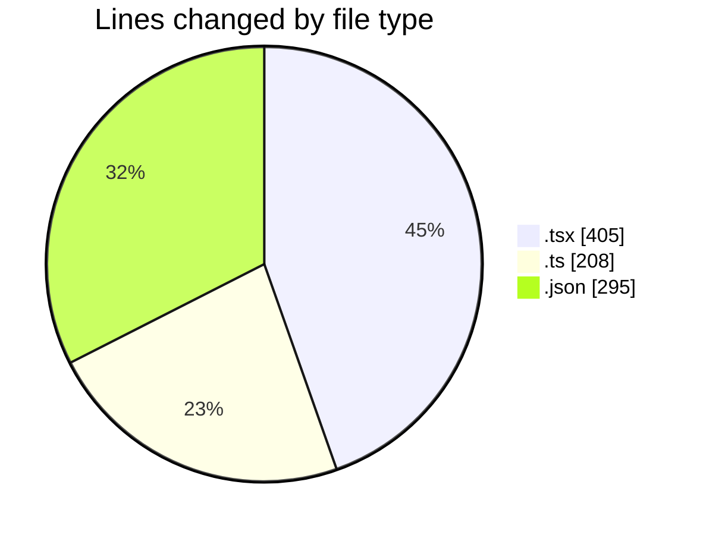
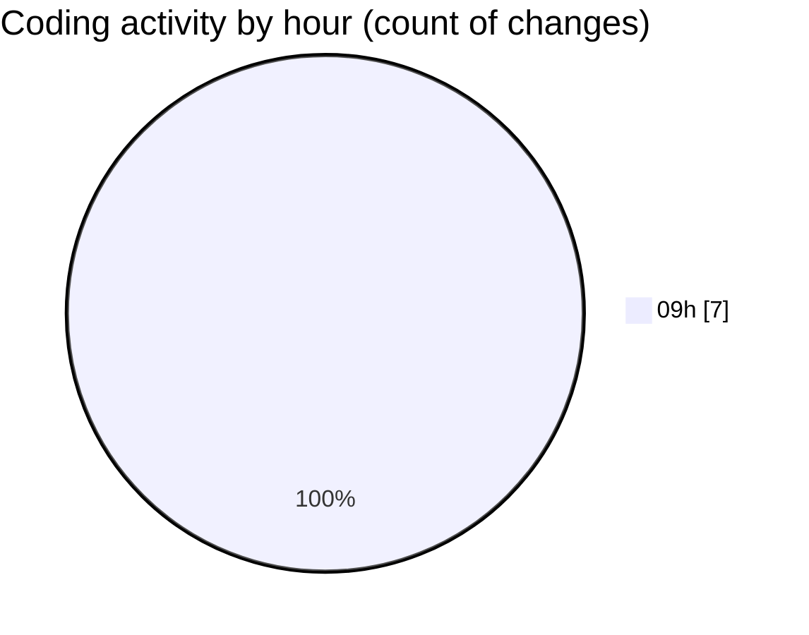

# eventscop-frontend-guide (Workspace) - Activity Summary 

## Overall Statistics

| Stat                   | Value                                                             |
| ---------------------- | ----------------------------------------------------------------- |
| **Lines Added** (➕)   | 904                                          |
| **Lines Removed** (➖) | 4                                        |
| **Net Change** (↕)    | 900                |
| **Active Time** (⌚)   | 7 minutes |

## Modified Files
- **CompareDrawer.tsx** (+119, -0)
- **Link.tsx** (+31, -0)
- **button.tsx** (+0, -1)
- **routing.ts** (+205, -3)
- **settings.json** (+295, -0)
- **page.tsx** (+254, -0)

## Visualizations

### By File Type (Lines Changed)

### By Hour (Estimated Activity Count)

> **Last Updated:** 10/9/2025, 9:58:14 AM