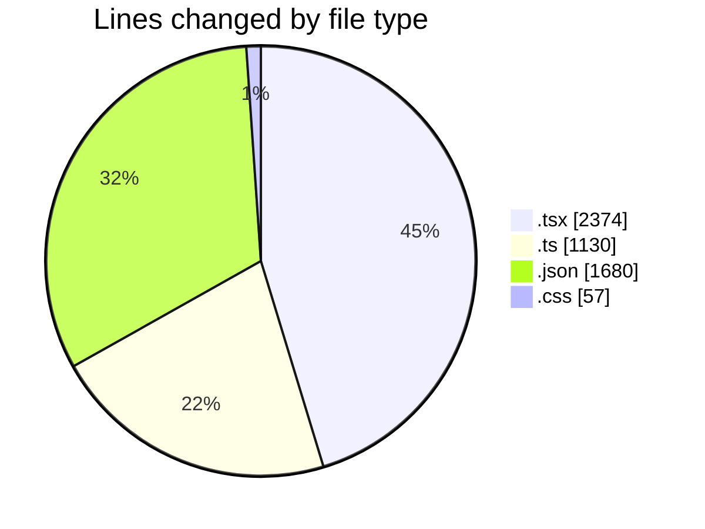
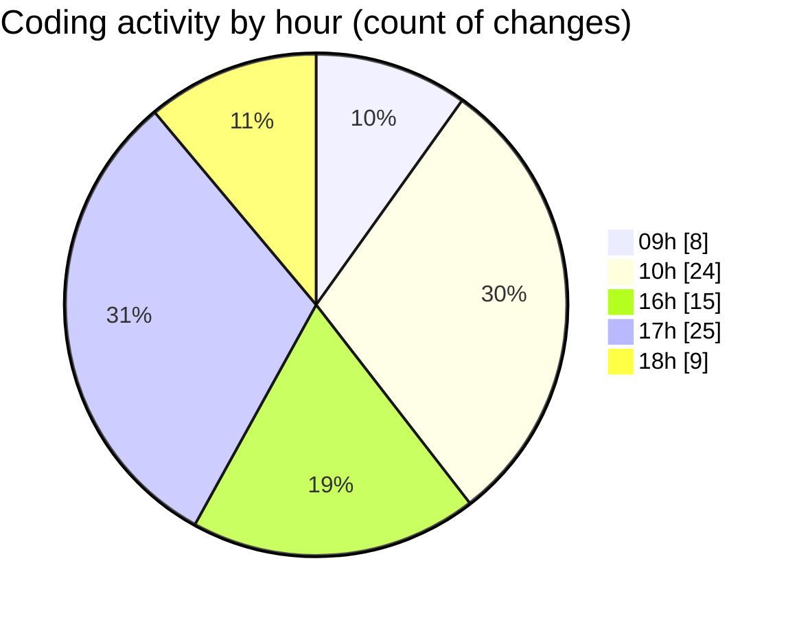

# eventscop-frontend-guide (Workspace) - Activity Summary 

## Overall Statistics

| Stat                   | Value                                                             |
| ---------------------- | ----------------------------------------------------------------- |
| **Lines Added** (➕)   | 5084                                          |
| **Lines Removed** (➖) | 157                                        |
| **Net Change** (↕)    | 4927                |
| **Active Time** (⌚)   | 136 minutes |

## Modified Files
- **CompareDrawer.tsx** (+119, -0)
- **Link.tsx** (+31, -2)
- **button.tsx** (+2, -3)
- **routing.ts** (+239, -33)
- **settings.json** (+295, -0)
- **page.tsx** (+265, -11)
- **page.tsx** (+119, -5)
- **page.tsx** (+872, -20)
- **page.tsx** (+379, -0)
- **page.tsx** (+88, -4)
- **page.tsx** (+74, -4)
- **page.tsx** (+83, -4)
- **page.tsx** (+93, -4)
- **suppliers.ts** (+182, -6)
- **SuggestionSection.tsx** (+67, -0)
- **search.ts** (+66, -0)
- **search.ts** (+187, -0)
- **SearchSubmenu.tsx** (+30, -5)
- **seo-utils.ts** (+77, -17)
- **navigation.ts** (+172, -5)
- **navigation.ts** (+55, -1)
- **fr.json** (+1385, -0)
- **useOrganizeNavigation.ts** (+58, -32)
- **MobileMenu.tsx** (+89, -1)
- **globals.css** (+57, -0)

## Visualizations

### By File Type (Lines Changed)

### By Hour (Estimated Activity Count)

> **Last Updated:** 10/9/2025, 6:23:15 PM