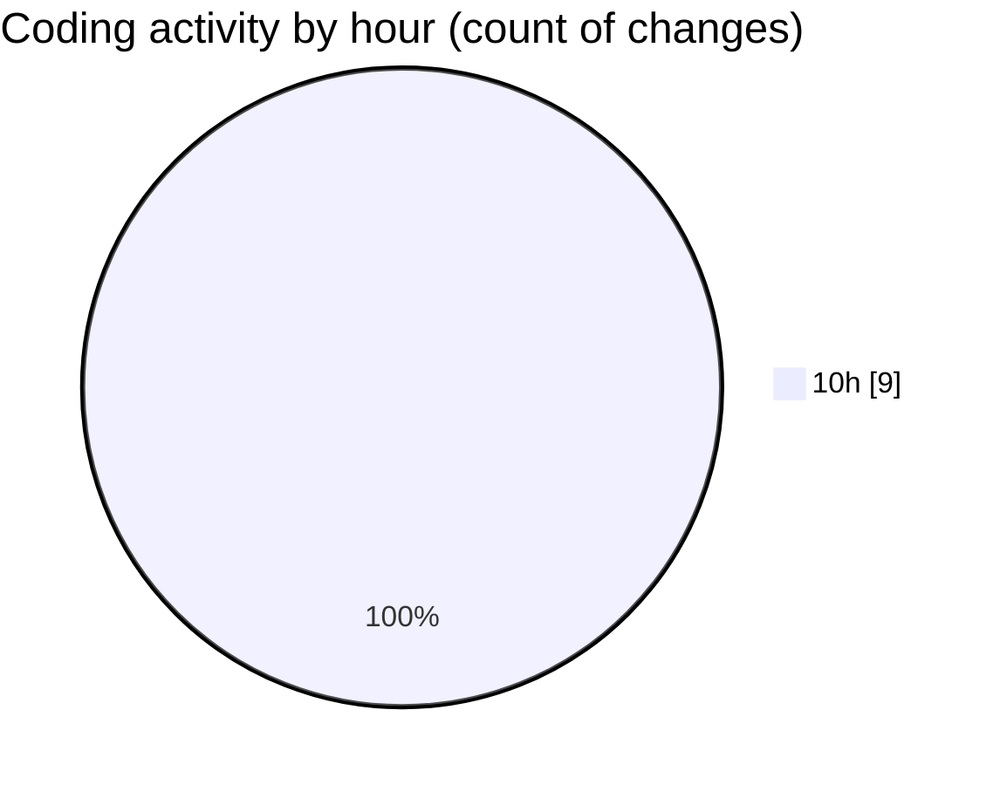

# eventscop-api-guide (Workspace) - Activity Summary 

## Overall Statistics

| Stat                   | Value                                                             |
| ---------------------- | ----------------------------------------------------------------- |
| **Lines Added** (➕)   | 308                                          |
| **Lines Removed** (➖) | 58                                        |
| **Net Change** (↕)    | 250                |
| **Active Time** (⌚)   | 9 minutes |

## Modified Files
- **main.py** (+251, -1)
- **routes.py** (+57, -57)

## Visualizations

### By File Type (Lines Changed)

### By Hour (Estimated Activity Count)

> **Last Updated:** 10/10/2025, 10:41:13 AM