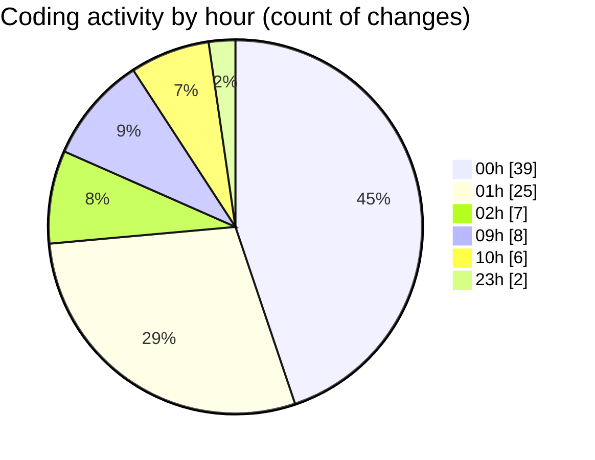

# eventscop-frontend-guide (Workspace) - Activity Summary 

## Overall Statistics

| Stat                   | Value                                                             |
| ---------------------- | ----------------------------------------------------------------- |
| **Lines Added** (➕)   | 1628                                          |
| **Lines Removed** (➖) | 262                                        |
| **Net Change** (↕)    | 1366                |
| **Active Time** (⌚)   | 140 minutes |

## Modified Files
- **VenueCard.tsx** (+876, -143)
- **page.tsx** (+278, -9)
- **RseScore.tsx** (+51, -0)
- **PlaceHorizontalCard.tsx** (+45, -0)
- **layout.tsx** (+104, -56)
- **globals.css** (+274, -54)

## Visualizations

### By File Type (Lines Changed)

### By Hour (Estimated Activity Count)

> **Last Updated:** 10/10/2025, 10:10:58 AM