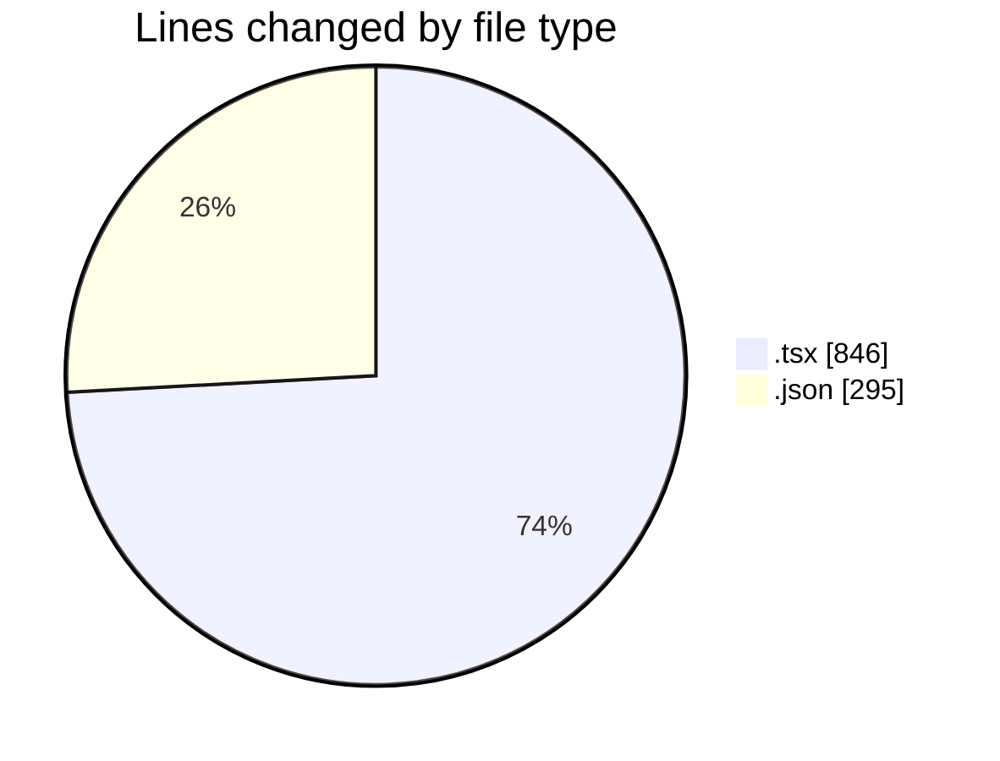
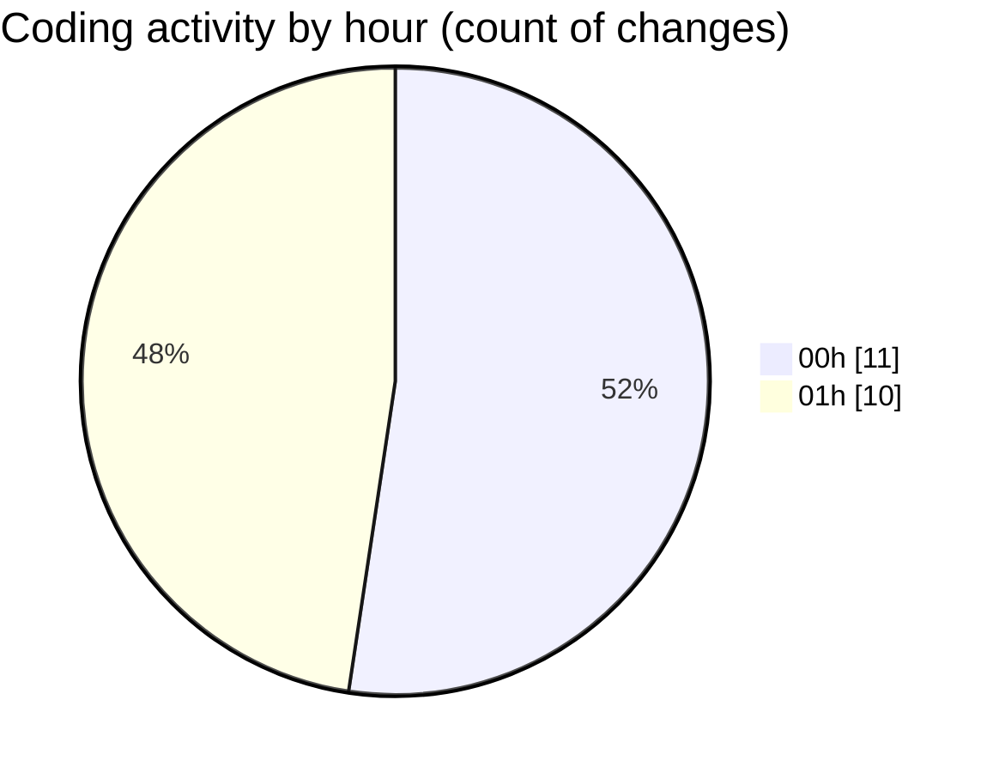

# eventscop-frontend-guide (Workspace) - Activity Summary 

## Overall Statistics

| Stat                   | Value                                                             |
| ---------------------- | ----------------------------------------------------------------- |
| **Lines Added** (➕)   | 1134                                          |
| **Lines Removed** (➖) | 7                                        |
| **Net Change** (↕)    | 1127                |
| **Active Time** (⌚)   | 40 minutes |

## Modified Files
- **page.tsx** (+406, -2)
- **PlaceQuoteSidebar.tsx** (+68, -0)
- **PlaceQuoteForm.tsx** (+73, -0)
- **settings.json** (+295, -0)
- **QuoteTarifs.tsx** (+52, -2)
- **PlaceQuoteButton.tsx** (+60, -0)
- **ContactButtons.tsx** (+154, -3)
- **ActionSection.tsx** (+26, -0)

## Visualizations

### By File Type (Lines Changed)

### By Hour (Estimated Activity Count)

> **Last Updated:** 10/11/2025, 1:30:59 AM