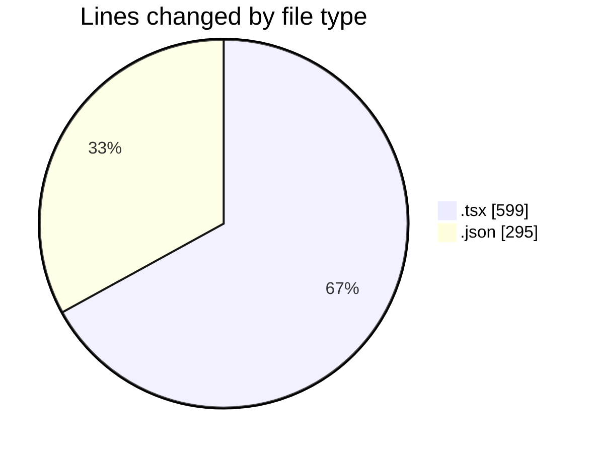
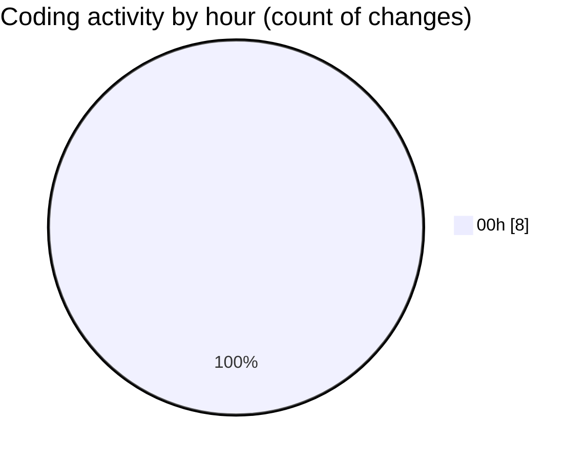

# eventscop-frontend-guide (Workspace) - Activity Summary 

## Overall Statistics

| Stat                   | Value                                                             |
| ---------------------- | ----------------------------------------------------------------- |
| **Lines Added** (➕)   | 892                                          |
| **Lines Removed** (➖) | 2                                        |
| **Net Change** (↕)    | 890                |
| **Active Time** (⌚)   | 18 minutes |

## Modified Files
- **page.tsx** (+406, -2)
- **PlaceQuoteSidebar.tsx** (+68, -0)
- **PlaceQuoteForm.tsx** (+73, -0)
- **settings.json** (+295, -0)
- **QuoteTarifs.tsx** (+50, -0)

## Visualizations

### By File Type (Lines Changed)

### By Hour (Estimated Activity Count)

> **Last Updated:** 10/11/2025, 12:45:59 AM