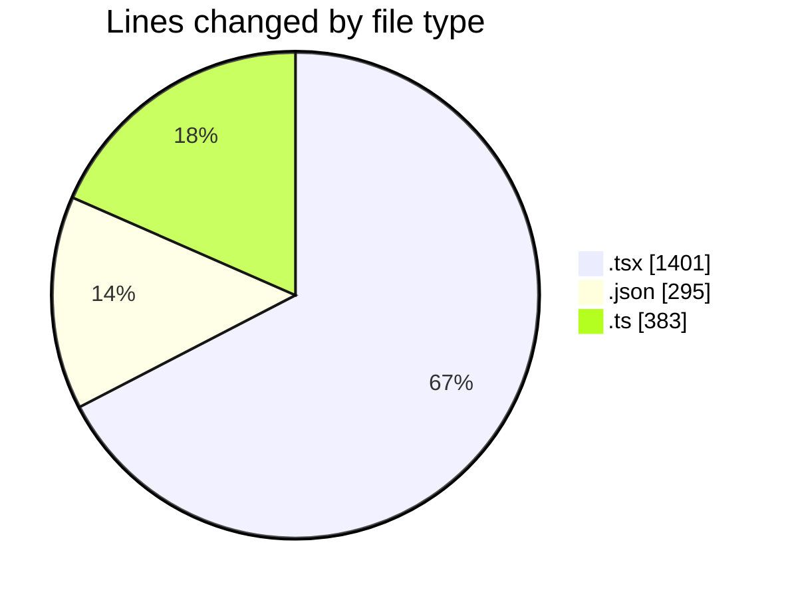
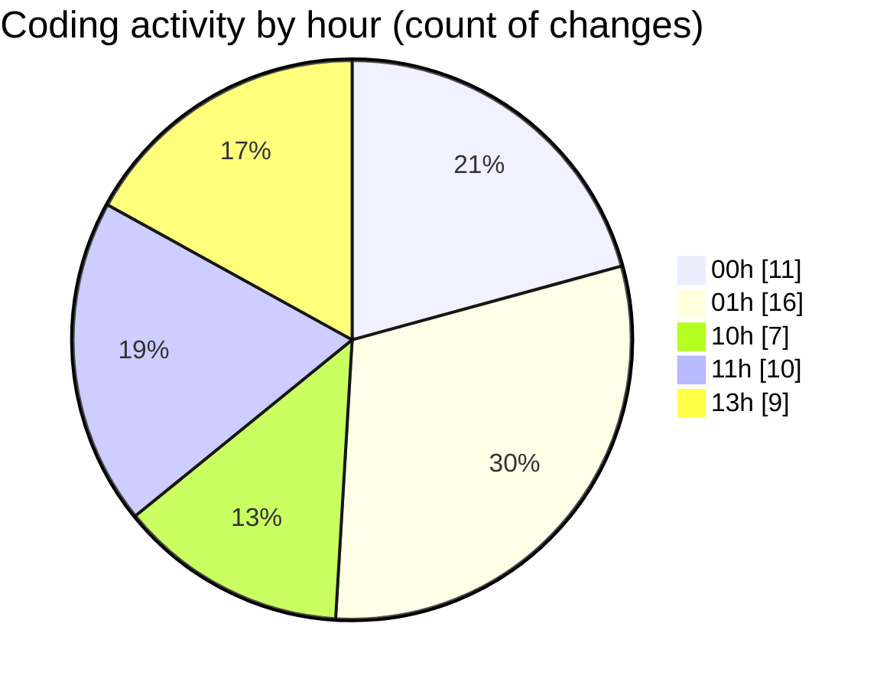

# eventscop-frontend-guide (Workspace) - Activity Summary 

## Overall Statistics

| Stat                   | Value                                                             |
| ---------------------- | ----------------------------------------------------------------- |
| **Lines Added** (➕)   | 2010                                          |
| **Lines Removed** (➖) | 69                                        |
| **Net Change** (↕)    | 1941                |
| **Active Time** (⌚)   | 89 minutes |

## Modified Files
- **page.tsx** (+406, -2)
- **PlaceQuoteSidebar.tsx** (+68, -0)
- **PlaceQuoteForm.tsx** (+73, -0)
- **settings.json** (+295, -0)
- **QuoteTarifs.tsx** (+52, -2)
- **PlaceQuoteButton.tsx** (+60, -0)
- **ContactButtons.tsx** (+157, -31)
- **ActionSection.tsx** (+26, -0)
- **QuoteBottomBar.tsx** (+222, -28)
- **HallTableFooter.tsx** (+30, -0)
- **HallTableHeader.tsx** (+58, -4)
- **HallRow.tsx** (+82, -2)
- **HallCell.tsx** (+26, -0)
- **HallTable.tsx** (+72, -0)
- **cart.ts** (+383, -0)

## Visualizations

### By File Type (Lines Changed)

### By Hour (Estimated Activity Count)

> **Last Updated:** 10/11/2025, 1:46:02 PM