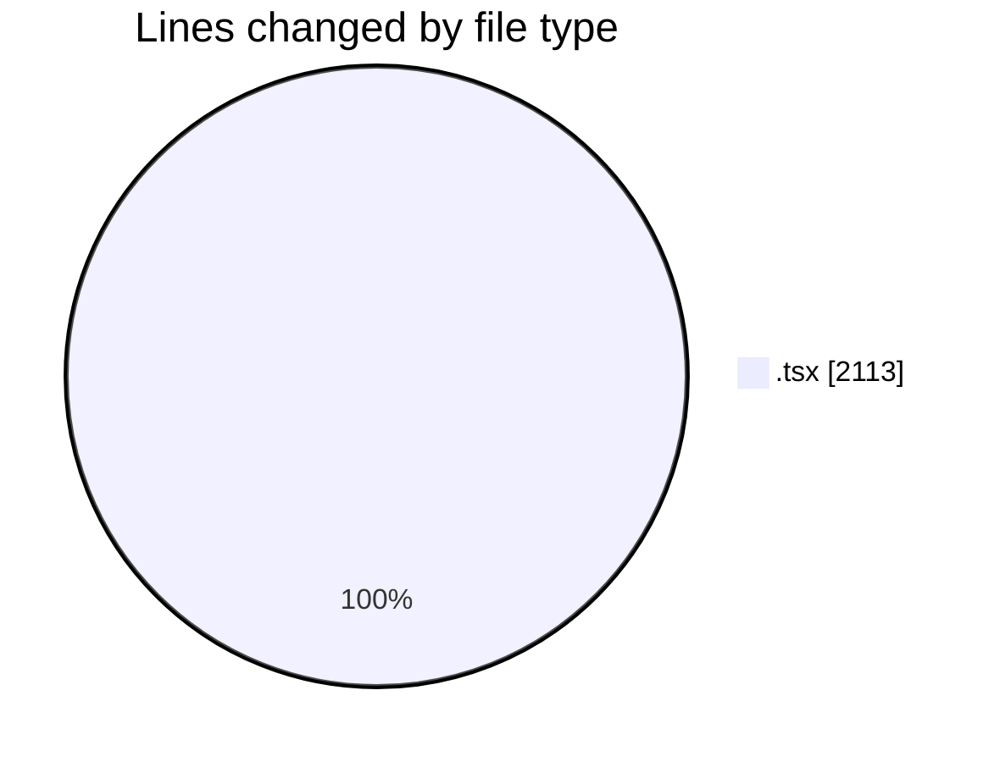
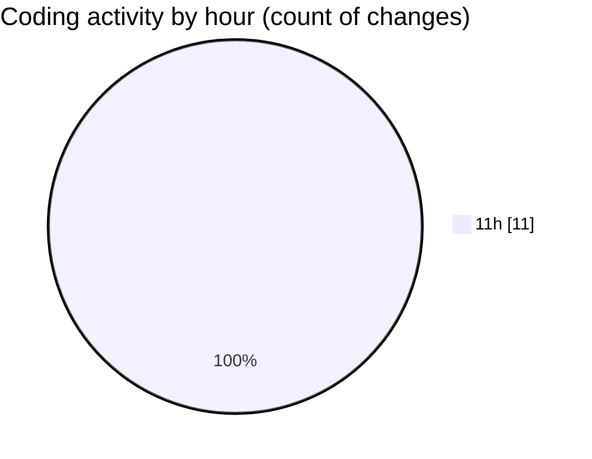

# eventscop-frontend-guide (Workspace) - Activity Summary 

## Overall Statistics

| Stat                   | Value                                                             |
| ---------------------- | ----------------------------------------------------------------- |
| **Lines Added** (➕)   | 1967                                          |
| **Lines Removed** (➖) | 146                                        |
| **Net Change** (↕)    | 1821                |
| **Active Time** (⌚)   | 12 minutes |

## Modified Files
- **page.tsx** (+5, -0)
- **support.tsx** (+897, -0)
- **page.tsx** (+177, -146)
- **page.tsx** (+31, -0)
- **nutrition_eval_form.tsx** (+857, -0)

## Visualizations

### By File Type (Lines Changed)

### By Hour (Estimated Activity Count)

> **Last Updated:** 10/12/2025, 11:26:06 AM