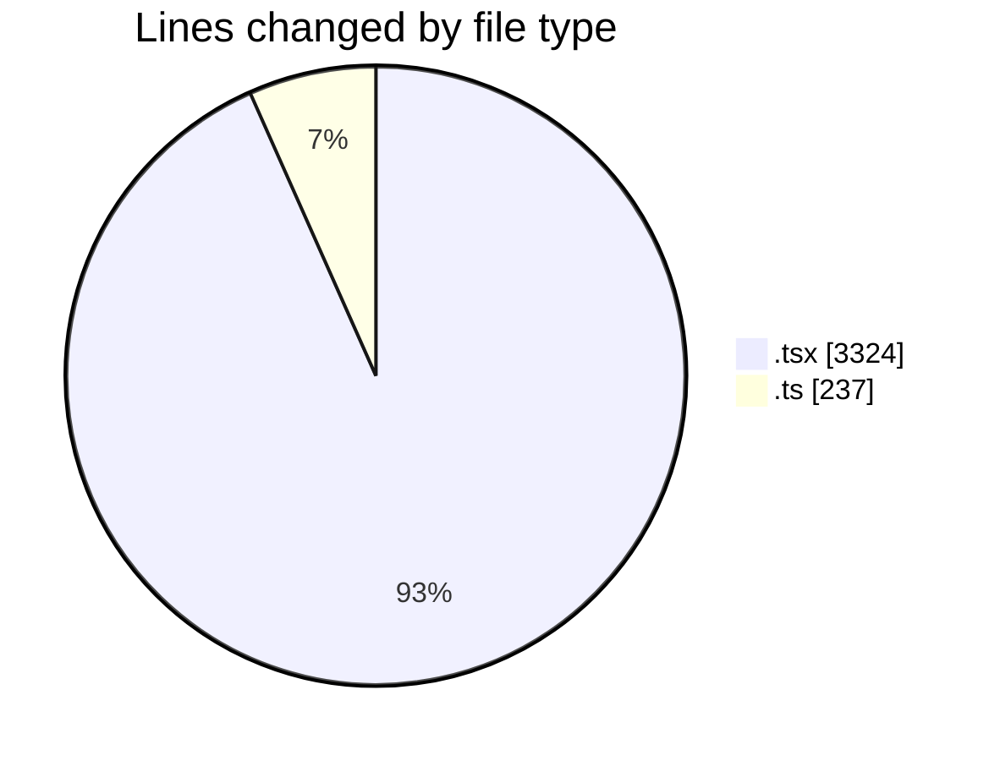
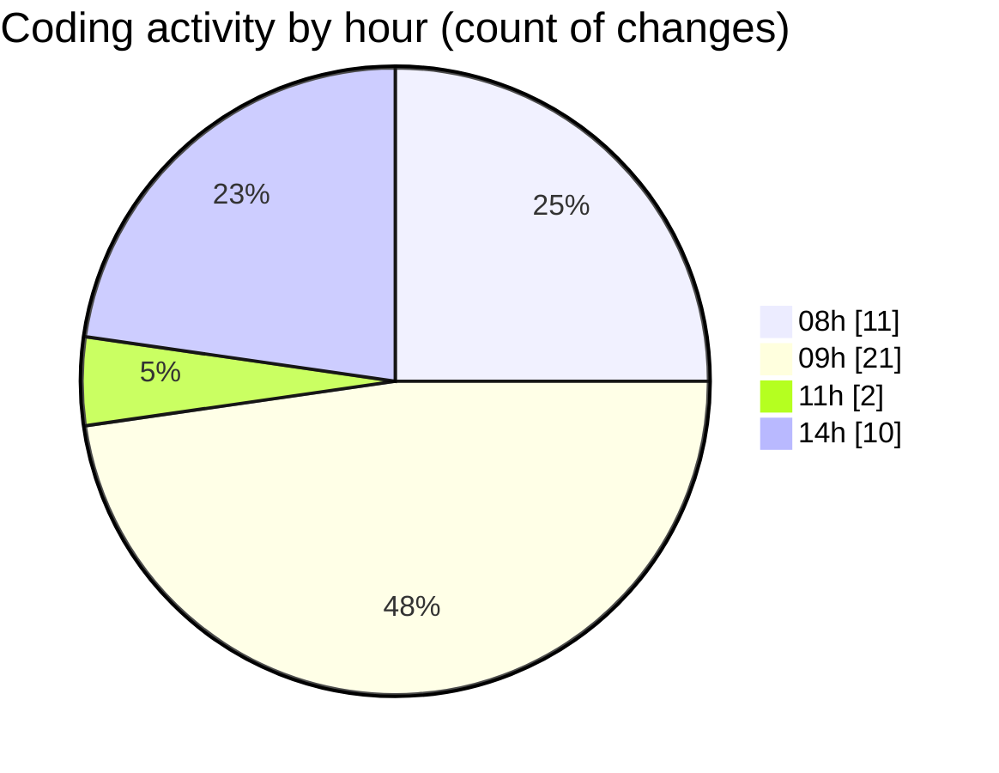

# eventscop-frontend-guide (Workspace) - Activity Summary 

## Overall Statistics

| Stat                   | Value                                                             |
| ---------------------- | ----------------------------------------------------------------- |
| **Lines Added** (➕)   | 3493                                          |
| **Lines Removed** (➖) | 68                                        |
| **Net Change** (↕)    | 3425                |
| **Active Time** (⌚)   | 48 minutes |

## Modified Files
- **page.tsx** (+0, -3)
- **page.tsx** (+31, -13)
- **page.tsx** (+31, -12)
- **layout.tsx** (+48, -33)
- **support.tsx** (+1141, -0)
- **nutrition_eval_form.tsx** (+857, -0)
- **VenueCard.tsx** (+1, -0)
- **GeneralEntityTextBlock.tsx** (+49, -1)
- **utils-client.ts** (+231, -6)
- **page.tsx** (+295, -0)
- **page.tsx** (+230, -0)
- **page.tsx** (+299, -0)
- **page.tsx** (+280, -0)

## Visualizations

### By File Type (Lines Changed)

### By Hour (Estimated Activity Count)

> **Last Updated:** 10/13/2025, 2:41:34 PM