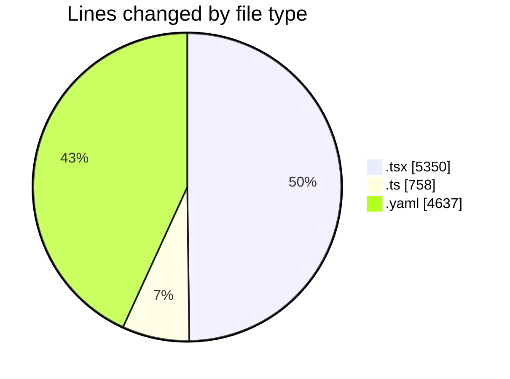
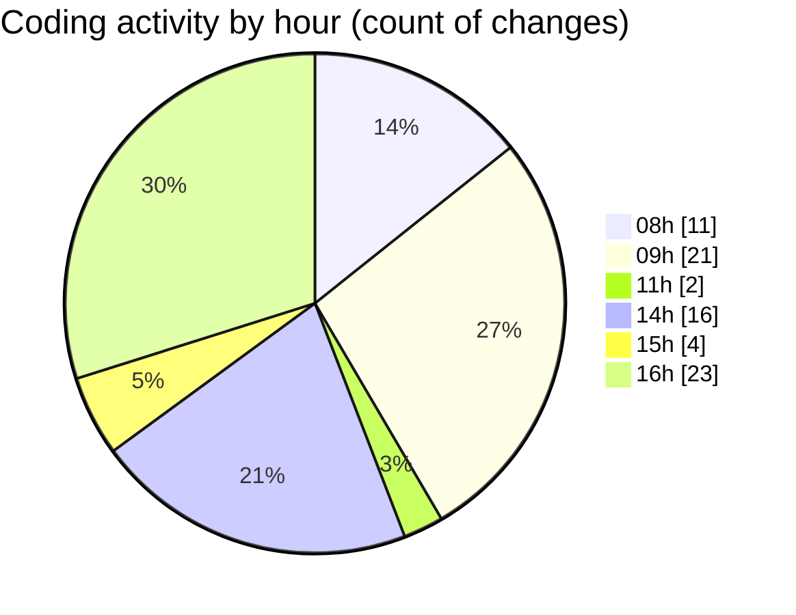

# eventscop-frontend-guide (Workspace) - Activity Summary 

## Overall Statistics

| Stat                   | Value                                                             |
| ---------------------- | ----------------------------------------------------------------- |
| **Lines Added** (➕)   | 10675                                          |
| **Lines Removed** (➖) | 70                                        |
| **Net Change** (↕)    | 10605                |
| **Active Time** (⌚)   | 89 minutes |

## Modified Files
- **page.tsx** (+0, -3)
- **page.tsx** (+31, -13)
- **page.tsx** (+31, -12)
- **layout.tsx** (+48, -33)
- **support.tsx** (+1141, -0)
- **nutrition_eval_form.tsx** (+857, -0)
- **VenueCard.tsx** (+1, -0)
- **GeneralEntityTextBlock.tsx** (+49, -1)
- **utils-client.ts** (+423, -7)
- **page.tsx** (+295, -0)
- **page.tsx** (+230, -0)
- **page.tsx** (+299, -0)
- **page.tsx** (+280, -0)
- **page.tsx** (+262, -1)
- **page.tsx** (+230, -0)
- **page.tsx** (+295, -0)
- **page.tsx** (+299, -0)
- **page.tsx** (+280, -0)
- **page.tsx** (+315, -0)
- **MapColumnContainer.tsx** (+30, -0)
- **PlaceList.tsx** (+110, -0)
- **SearchContainer.tsx** (+89, -0)
- **pnpm-lock.yaml** (+4637, -0)
- **pages.ts** (+287, -0)
- **page.ts** (+41, -0)
- **PlaceCardDescription.tsx** (+89, -0)
- **MapColumnContainerClient.tsx** (+26, -0)

## Visualizations

### By File Type (Lines Changed)

### By Hour (Estimated Activity Count)

> **Last Updated:** 10/13/2025, 4:41:34 PM