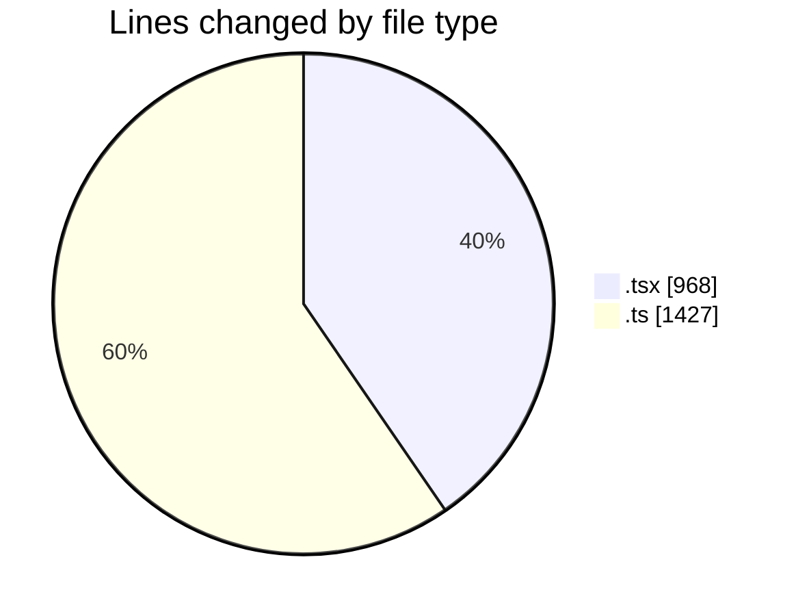
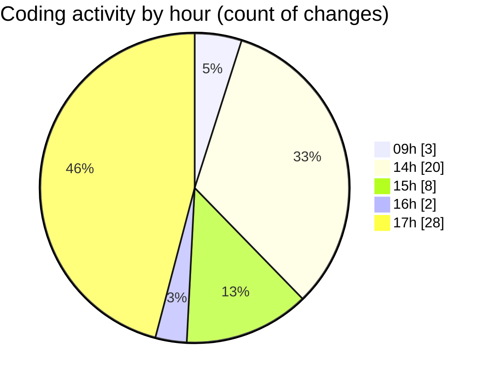

# eventscop-frontend-guide (Workspace) - Activity Summary 

## Overall Statistics

| Stat                   | Value                                                             |
| ---------------------- | ----------------------------------------------------------------- |
| **Lines Added** (➕)   | 2308                                          |
| **Lines Removed** (➖) | 87                                        |
| **Net Change** (↕)    | 2221                |
| **Active Time** (⌚)   | 81 minutes |

## Modified Files
- **ActivityCard.tsx** (+166, -8)
- **halltable.ts** (+20, -0)
- **HallRow.tsx** (+84, -10)
- **HallTable.tsx** (+90, -22)
- **HallTableFooter.tsx** (+37, -11)
- **HallTableHeader.tsx** (+58, -9)
- **cart.ts** (+383, -0)
- **supplier-activity.ts** (+391, -0)
- **SearchActivityContainer.tsx** (+85, -1)
- **HeaderLogo.tsx** (+20, -0)
- **Header.tsx** (+31, -0)
- **place.ts** (+21, -1)
- **AsyncSidebar.tsx** (+34, -10)
- **supplier.ts** (+610, -1)
- **SidebarWrapper.tsx** (+24, -0)
- **page.tsx** (+24, -14)
- **page.tsx** (+230, -0)

## Visualizations

### By File Type (Lines Changed)

### By Hour (Estimated Activity Count)

> **Last Updated:** 10/14/2025, 6:00:12 PM