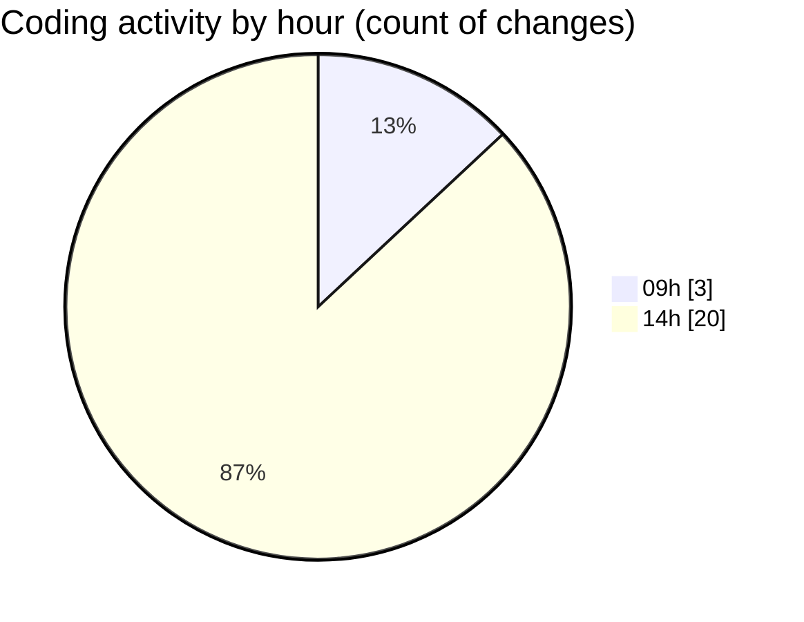

# eventscop-frontend-guide (Workspace) - Activity Summary 

## Overall Statistics

| Stat                   | Value                                                             |
| ---------------------- | ----------------------------------------------------------------- |
| **Lines Added** (➕)   | 425                                          |
| **Lines Removed** (➖) | 42                                        |
| **Net Change** (↕)    | 383                |
| **Active Time** (⌚)   | 25 minutes |

## Modified Files
- **ActivityCard.tsx** (+166, -8)
- **halltable.ts** (+20, -0)
- **HallRow.tsx** (+82, -6)
- **HallTable.tsx** (+72, -13)
- **HallTableFooter.tsx** (+31, -8)
- **HallTableHeader.tsx** (+54, -7)

## Visualizations

### By File Type (Lines Changed)

### By Hour (Estimated Activity Count)

> **Last Updated:** 10/14/2025, 2:30:11 PM