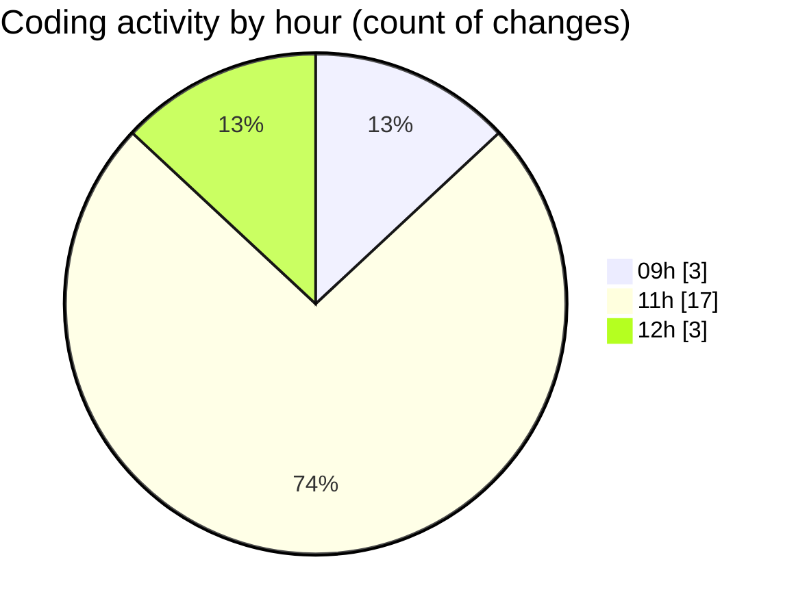

# eventscop-api-guide (Workspace) - Activity Summary 

## Overall Statistics

| Stat                   | Value                                                             |
| ---------------------- | ----------------------------------------------------------------- |
| **Lines Added** (➕)   | 2413                                          |
| **Lines Removed** (➖) | 26                                        |
| **Net Change** (↕)    | 2387                |
| **Active Time** (⌚)   | 20 minutes |

## Modified Files
- **activity_search_engine.py** (+530, -1)
- **routes.py** (+828, -21)
- **routes.py** (+118, -3)
- **prices.py** (+25, -1)
- **search_engine.py** (+912, -0)

## Visualizations

### By File Type (Lines Changed)

### By Hour (Estimated Activity Count)

> **Last Updated:** 10/15/2025, 12:10:13 PM