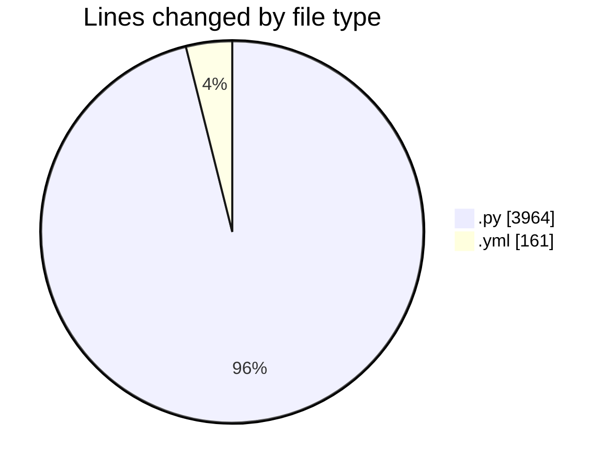
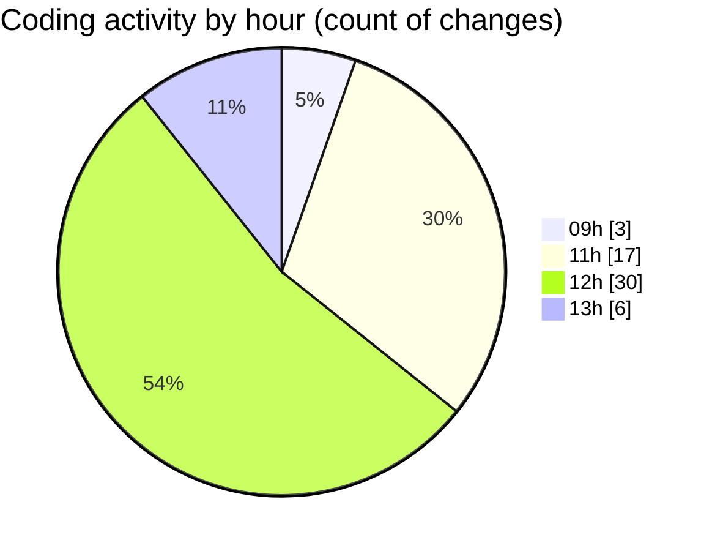

# eventscop-api-guide (Workspace) - Activity Summary 

## Overall Statistics

| Stat                   | Value                                                             |
| ---------------------- | ----------------------------------------------------------------- |
| **Lines Added** (➕)   | 3784                                          |
| **Lines Removed** (➖) | 341                                        |
| **Net Change** (↕)    | 3443                |
| **Active Time** (⌚)   | 66 minutes |

## Modified Files
- **activity_search_engine.py** (+562, -33)
- **routes.py** (+911, -104)
- **routes.py** (+140, -25)
- **prices.py** (+25, -1)
- **search_engine.py** (+1118, -149)
- **.gitlab-ci.yml** (+135, -26)
- **routes.py** (+587, -0)
- **__init__.py** (+18, -0)
- **main.py** (+253, -0)
- **timing.py** (+35, -3)

## Visualizations

### By File Type (Lines Changed)

### By Hour (Estimated Activity Count)

> **Last Updated:** 10/15/2025, 1:10:13 PM