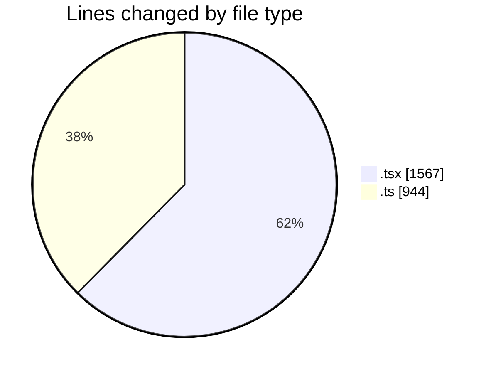
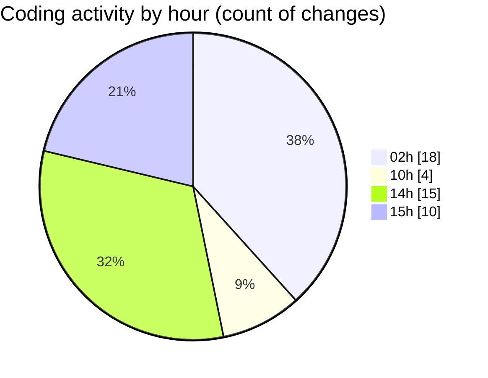

# eventscop-frontend-guide (Workspace) - Activity Summary 

## Overall Statistics

| Stat                   | Value                                                             |
| ---------------------- | ----------------------------------------------------------------- |
| **Lines Added** (➕)   | 2282                                          |
| **Lines Removed** (➖) | 229                                        |
| **Net Change** (↕)    | 2053                |
| **Active Time** (⌚)   | 77 minutes |

## Modified Files
- **page.tsx** (+262, -3)
- **SearchContainer.tsx** (+91, -3)
- **suppliers.ts** (+257, -21)
- **sanitize-server.ts** (+107, -106)
- **utils-server.ts** (+155, -3)
- **DesktopSearchForm.tsx** (+210, -33)
- **SearchForm.tsx** (+265, -11)
- **auth-token-manager.ts** (+17, -0)
- **supplier-highlights.ts** (+95, -5)
- **cache.ts** (+145, -5)
- **cache-tags.ts** (+27, -1)
- **SearchFormClient.tsx** (+324, -38)
- **page.tsx** (+240, -0)
- **ActivityGrid.tsx** (+87, -0)

## Visualizations

### By File Type (Lines Changed)

### By Hour (Estimated Activity Count)

> **Last Updated:** 10/15/2025, 4:00:12 PM