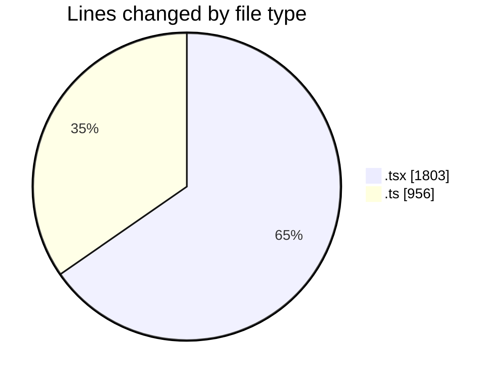
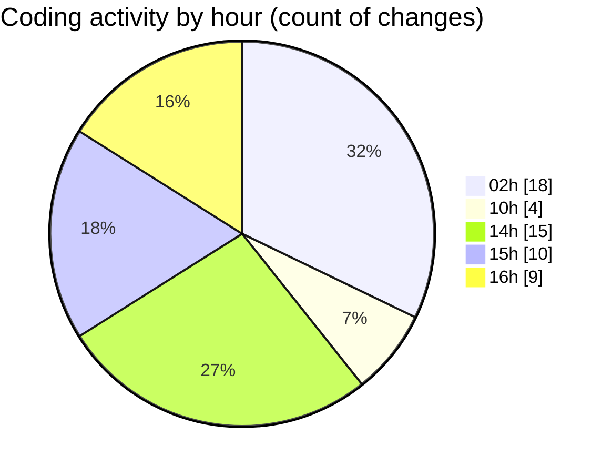

# eventscop-frontend-guide (Workspace) - Activity Summary 

## Overall Statistics

| Stat                   | Value                                                             |
| ---------------------- | ----------------------------------------------------------------- |
| **Lines Added** (➕)   | 2417                                          |
| **Lines Removed** (➖) | 342                                        |
| **Net Change** (↕)    | 2075                |
| **Active Time** (⌚)   | 83 minutes |

## Modified Files
- **page.tsx** (+262, -3)
- **SearchContainer.tsx** (+91, -3)
- **suppliers.ts** (+257, -21)
- **sanitize-server.ts** (+107, -106)
- **utils-server.ts** (+155, -3)
- **DesktopSearchForm.tsx** (+210, -45)
- **SearchForm.tsx** (+265, -14)
- **auth-token-manager.ts** (+17, -0)
- **supplier-highlights.ts** (+100, -5)
- **cache.ts** (+151, -5)
- **cache-tags.ts** (+28, -1)
- **SearchFormClient.tsx** (+324, -76)
- **page.tsx** (+240, -10)
- **ActivityGrid.tsx** (+87, -50)
- **SupplierSearchClient.tsx** (+123, -0)

## Visualizations

### By File Type (Lines Changed)

### By Hour (Estimated Activity Count)

> **Last Updated:** 10/15/2025, 4:21:11 PM