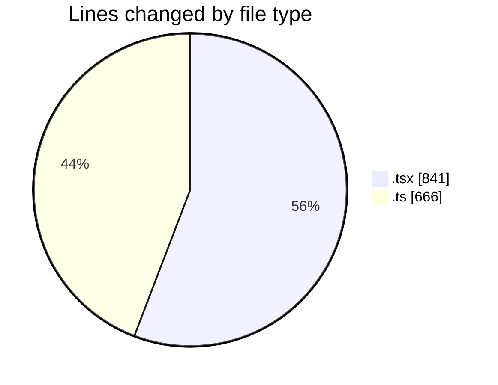
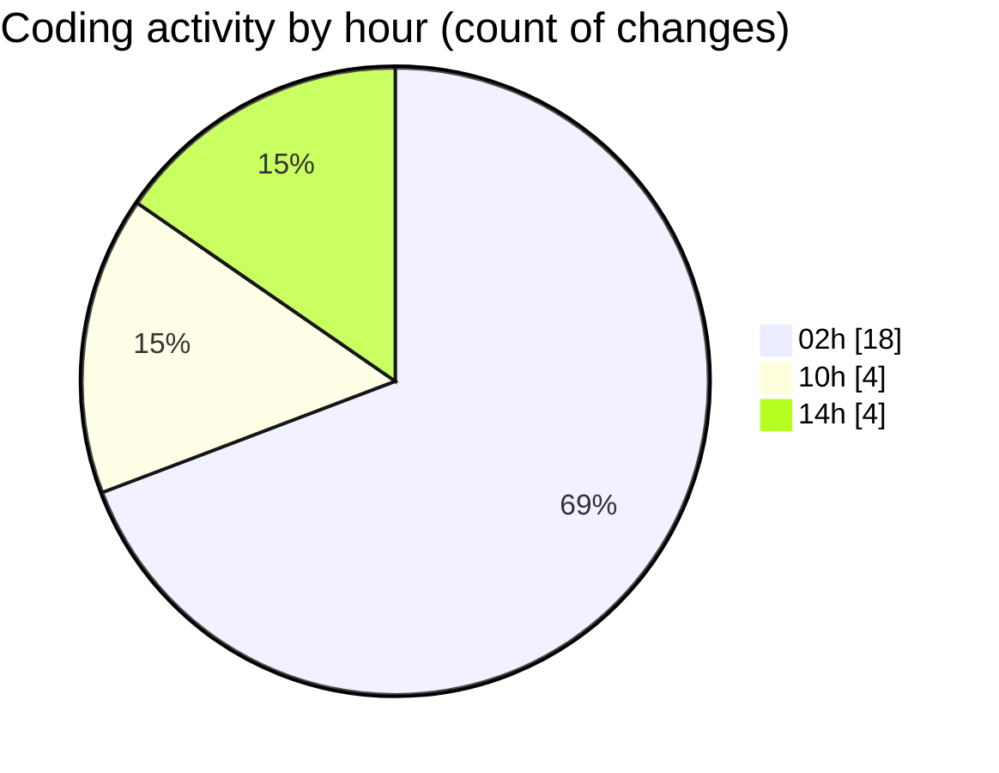

# eventscop-frontend-guide (Workspace) - Activity Summary 

## Overall Statistics

| Stat                   | Value                                                             |
| ---------------------- | ----------------------------------------------------------------- |
| **Lines Added** (➕)   | 1349                                          |
| **Lines Removed** (➖) | 158                                        |
| **Net Change** (↕)    | 1191                |
| **Active Time** (⌚)   | 35 minutes |

## Modified Files
- **page.tsx** (+262, -3)
- **SearchContainer.tsx** (+91, -3)
- **suppliers.ts** (+257, -21)
- **sanitize-server.ts** (+107, -106)
- **utils-server.ts** (+155, -3)
- **DesktopSearchForm.tsx** (+198, -21)
- **SearchForm.tsx** (+262, -1)
- **auth-token-manager.ts** (+17, -0)

## Visualizations

### By File Type (Lines Changed)

### By Hour (Estimated Activity Count)

> **Last Updated:** 10/15/2025, 2:40:12 PM