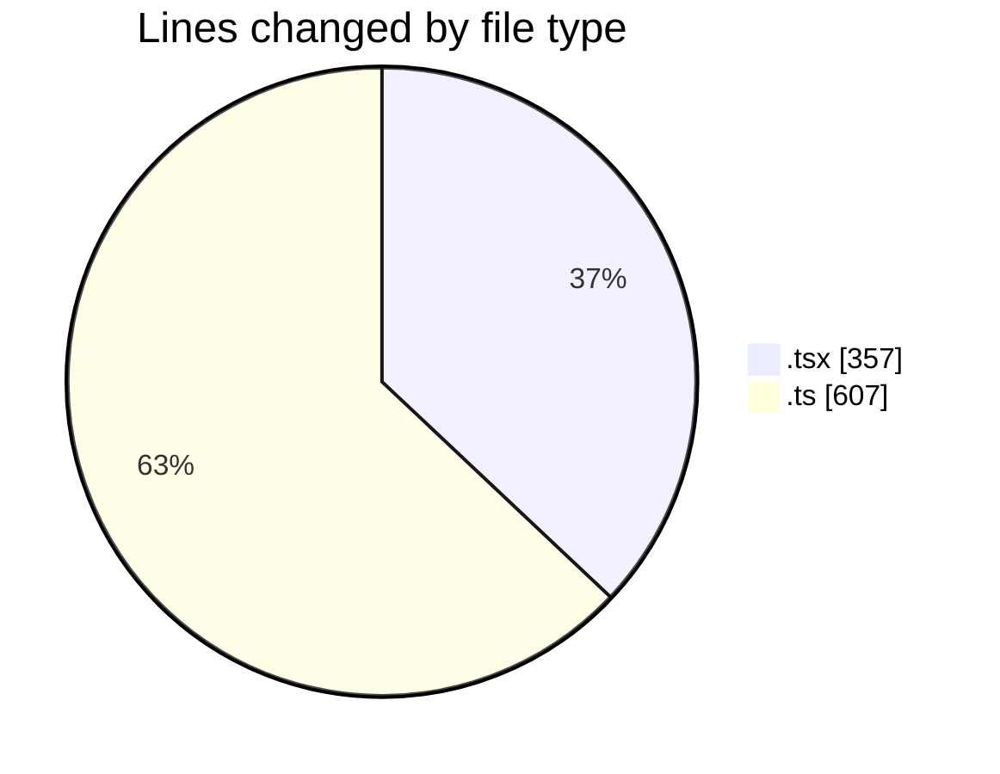
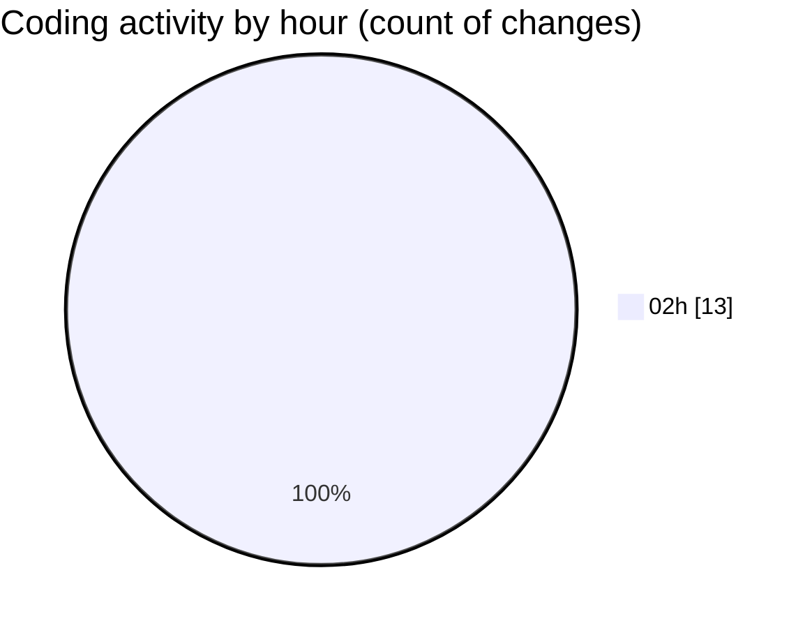

# eventscop-frontend-guide (Workspace) - Activity Summary 

## Overall Statistics

| Stat                   | Value                                                             |
| ---------------------- | ----------------------------------------------------------------- |
| **Lines Added** (➕)   | 850                                          |
| **Lines Removed** (➖) | 114                                        |
| **Net Change** (↕)    | 736                |
| **Active Time** (⌚)   | 19 minutes |

## Modified Files
- **page.tsx** (+262, -3)
- **SearchContainer.tsx** (+90, -2)
- **suppliers.ts** (+257, -2)
- **sanitize-server.ts** (+107, -106)
- **utils-server.ts** (+134, -1)

## Visualizations

### By File Type (Lines Changed)

### By Hour (Estimated Activity Count)

> **Last Updated:** 10/15/2025, 2:15:11 AM