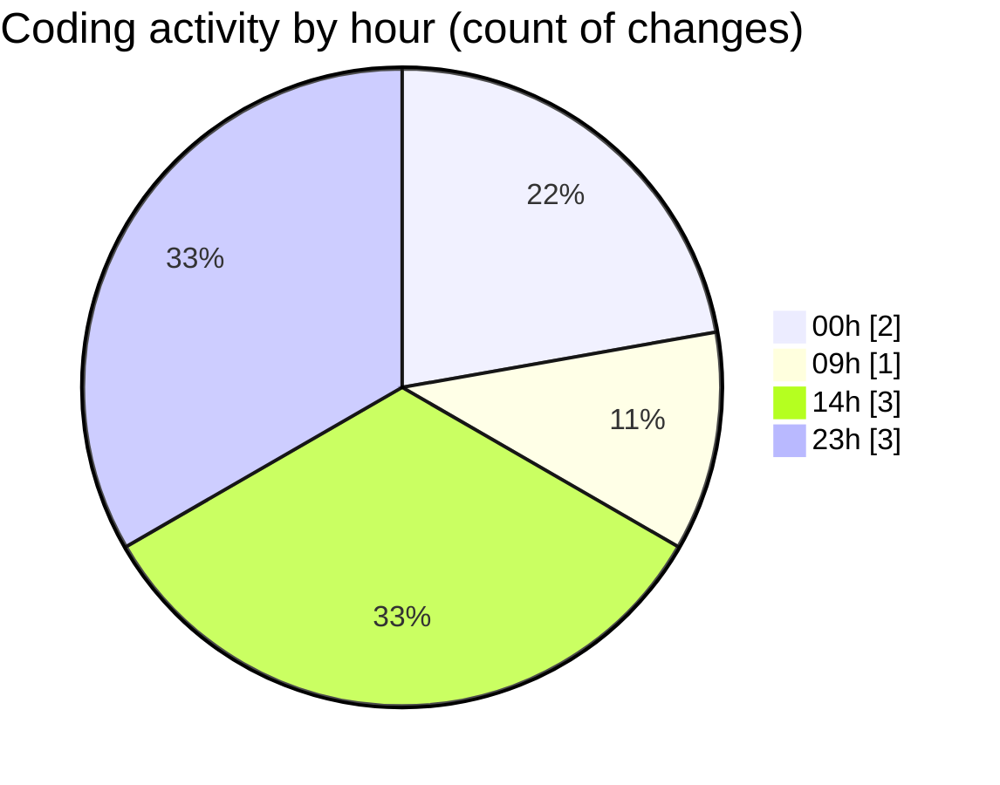

# eventscop-api-guide (Workspace) - Activity Summary 

## Overall Statistics

| Stat                   | Value                                                             |
| ---------------------- | ----------------------------------------------------------------- |
| **Lines Added** (➕)   | 294                                          |
| **Lines Removed** (➖) | 45                                        |
| **Net Change** (↕)    | 249                |
| **Active Time** (⌚)   | 10 minutes |

## Modified Files
- **routes.py** (+0, -20)
- **routes_card.py** (+0, -25)
- **Dockerfile** (+29, -0)
- **database.py** (+63, -0)
- **.env** (+53, -0)
- **e3bea9a52565_add_id_city_foreign_key_to_addresses_.py** (+149, -0)

## Visualizations

### By File Type (Lines Changed)

### By Hour (Estimated Activity Count)

> **Last Updated:** 10/16/2025, 2:25:21 PM