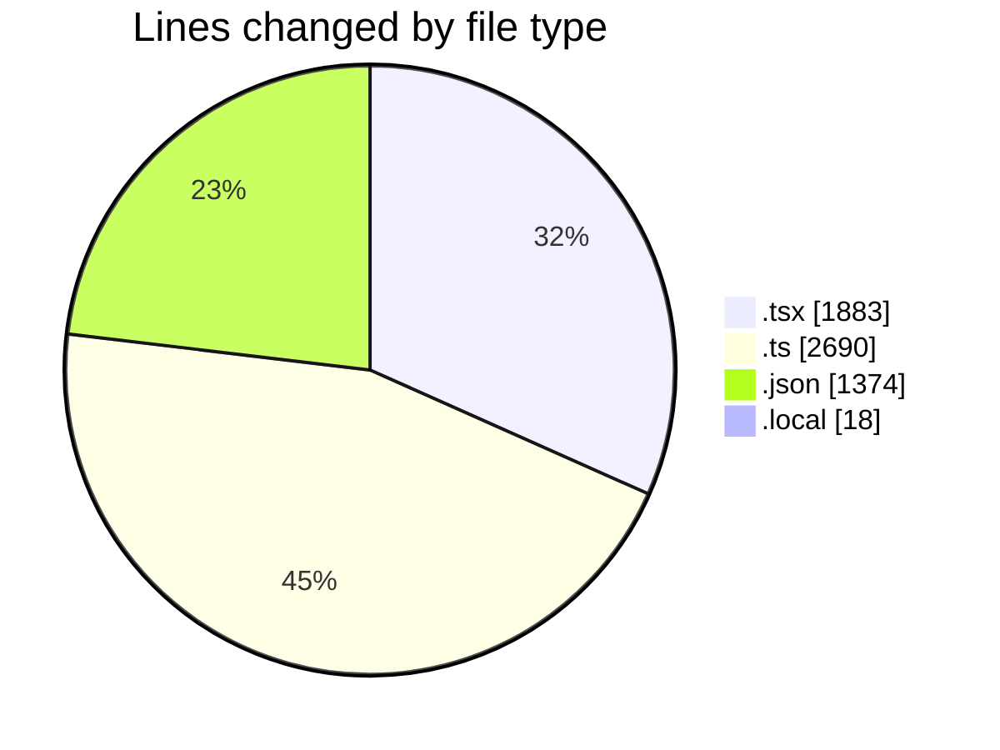
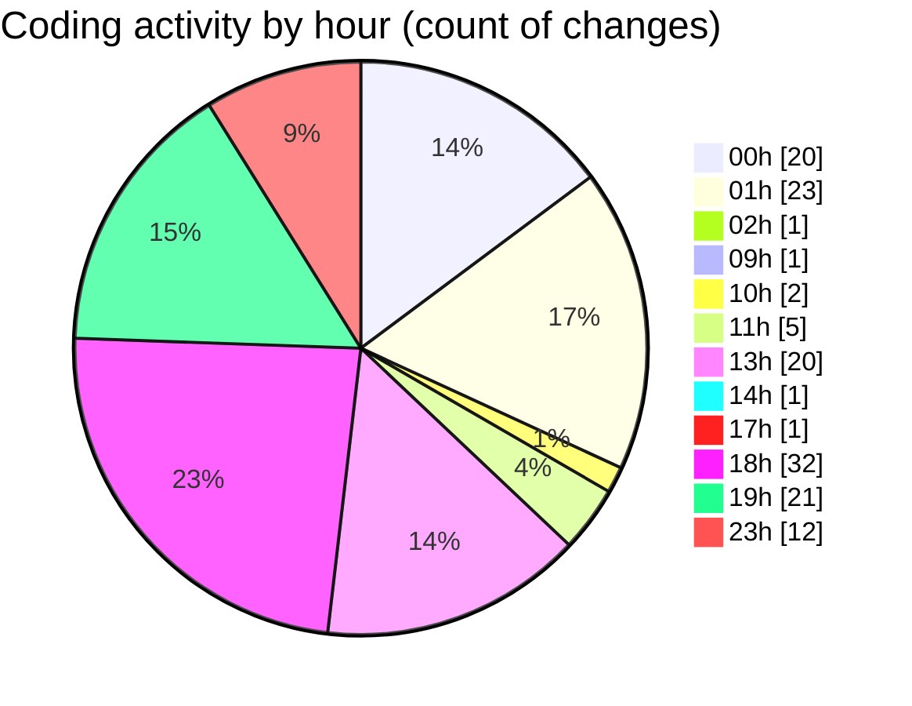

# eventscop-frontend-guide (Workspace) - Activity Summary 

## Overall Statistics

| Stat                   | Value                                                             |
| ---------------------- | ----------------------------------------------------------------- |
| **Lines Added** (➕)   | 5831                                          |
| **Lines Removed** (➖) | 134                                        |
| **Net Change** (↕)    | 5697                |
| **Active Time** (⌚)   | 194 minutes |

## Modified Files
- **ClientPresearchSection.tsx** (+93, -4)
- **PresearchSectionWrapper.tsx** (+103, -0)
- **ActivitySearchClient.tsx** (+122, -0)
- **cart.ts** (+3, -2)
- **cart.ts** (+21, -21)
- **routing.ts** (+206, -1)
- **HorizontalCardSection.tsx** (+59, -15)
- **LocationTabsContent.tsx** (+339, -1)
- **departments.ts** (+166, -0)
- **page.tsx** (+16, -10)
- **layout.tsx** (+163, -8)
- **HeadLinks.tsx** (+44, -29)
- **fr.json** (+1373, -1)
- **FooterContact.tsx** (+34, -1)
- **footer.ts** (+134, -1)
- **footer.ts** (+103, -2)
- **Footer.tsx** (+92, -1)
- **page.tsx** (+159, -0)
- **.env.local** (+18, -0)
- **page.tsx** (+11, -1)
- **url-mapping.ts** (+475, -1)
- **page.ts** (+85, -0)
- **page.tsx** (+317, -10)
- **middleware.ts** (+108, -0)
- **seo.ts** (+128, -0)
- **dynamic.ts** (+341, -4)
- **editorial-variables.ts** (+117, -0)
- **city.ts** (+164, -1)
- **search-form.ts** (+103, -1)
- **page.tsx** (+240, -0)
- **useSearchResultsCounter.ts** (+100, -2)
- **actions.ts** (+48, -1)
- **stats.ts** (+68, -1)
- **page.tsx** (+11, -0)
- **simple.ts** (+158, -13)
- **redirects.ts** (+109, -2)

## Visualizations

### By File Type (Lines Changed)

### By Hour (Estimated Activity Count)

> **Last Updated:** 10/16/2025, 11:41:19 PM