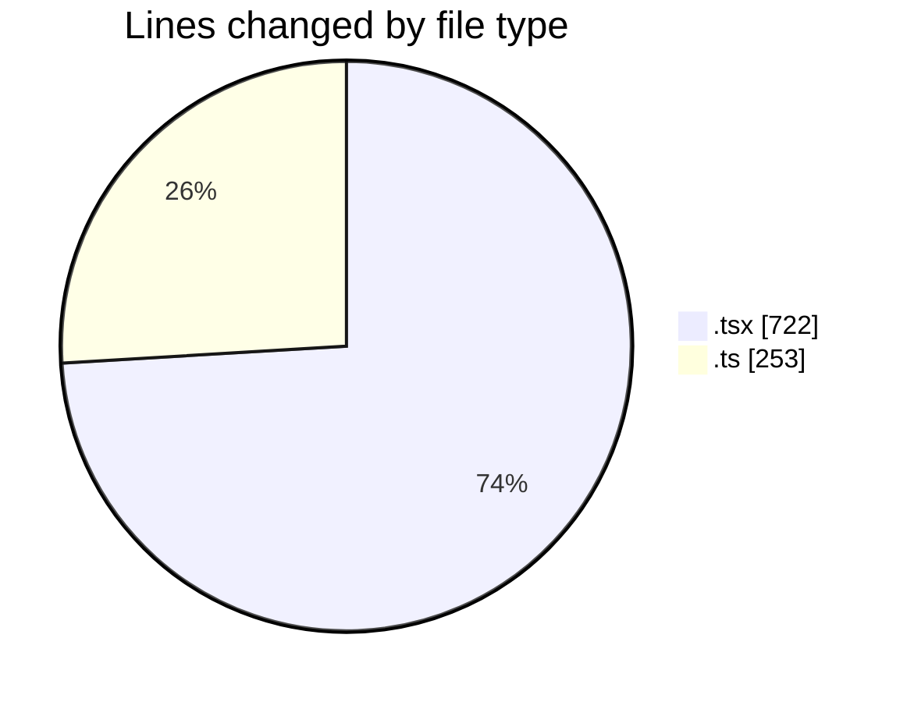
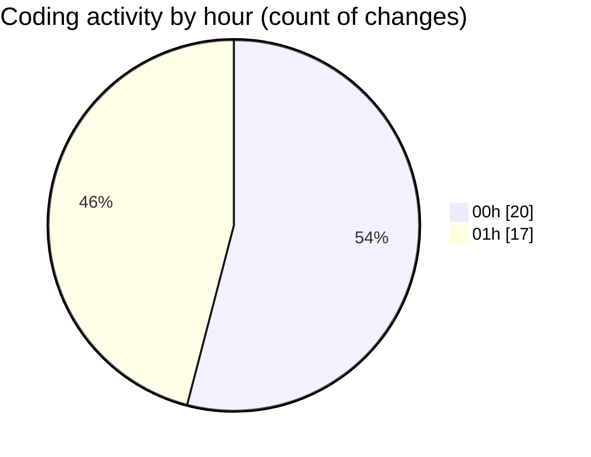

# eventscop-frontend-guide (Workspace) - Activity Summary 

## Overall Statistics

| Stat                   | Value                                                             |
| ---------------------- | ----------------------------------------------------------------- |
| **Lines Added** (➕)   | 939                                          |
| **Lines Removed** (➖) | 36                                        |
| **Net Change** (↕)    | 903                |
| **Active Time** (⌚)   | 55 minutes |

## Modified Files
- **ClientPresearchSection.tsx** (+93, -4)
- **PresearchSectionWrapper.tsx** (+103, -0)
- **ActivitySearchClient.tsx** (+122, -0)
- **cart.ts** (+3, -2)
- **cart.ts** (+21, -21)
- **routing.ts** (+206, -0)
- **HorizontalCardSection.tsx** (+52, -8)
- **LocationTabsContent.tsx** (+339, -1)

## Visualizations

### By File Type (Lines Changed)

### By Hour (Estimated Activity Count)

> **Last Updated:** 10/16/2025, 1:21:12 AM