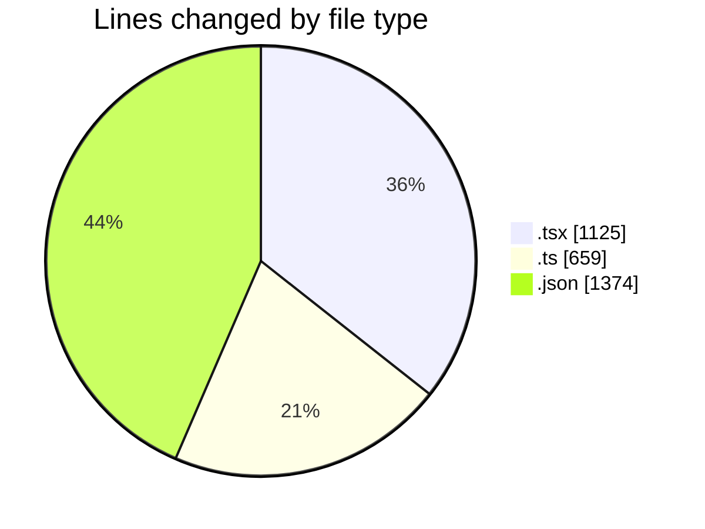
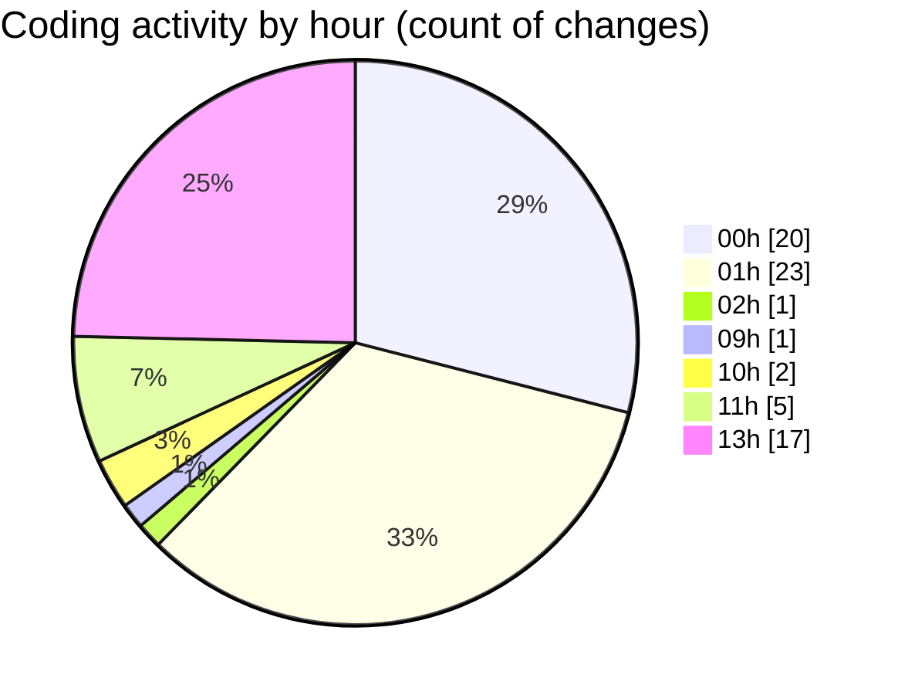

# eventscop-frontend-guide (Workspace) - Activity Summary 

## Overall Statistics

| Stat                   | Value                                                             |
| ---------------------- | ----------------------------------------------------------------- |
| **Lines Added** (➕)   | 3063                                          |
| **Lines Removed** (➖) | 95                                        |
| **Net Change** (↕)    | 2968                |
| **Active Time** (⌚)   | 92 minutes |

## Modified Files
- **ClientPresearchSection.tsx** (+93, -4)
- **PresearchSectionWrapper.tsx** (+103, -0)
- **ActivitySearchClient.tsx** (+122, -0)
- **cart.ts** (+3, -2)
- **cart.ts** (+21, -21)
- **routing.ts** (+206, -0)
- **HorizontalCardSection.tsx** (+59, -15)
- **LocationTabsContent.tsx** (+339, -1)
- **departments.ts** (+166, -0)
- **page.tsx** (+8, -9)
- **layout.tsx** (+163, -8)
- **HeadLinks.tsx** (+44, -29)
- **fr.json** (+1373, -1)
- **FooterContact.tsx** (+34, -1)
- **footer.ts** (+134, -1)
- **footer.ts** (+103, -2)
- **Footer.tsx** (+92, -1)

## Visualizations

### By File Type (Lines Changed)

### By Hour (Estimated Activity Count)

> **Last Updated:** 10/16/2025, 1:11:18 PM