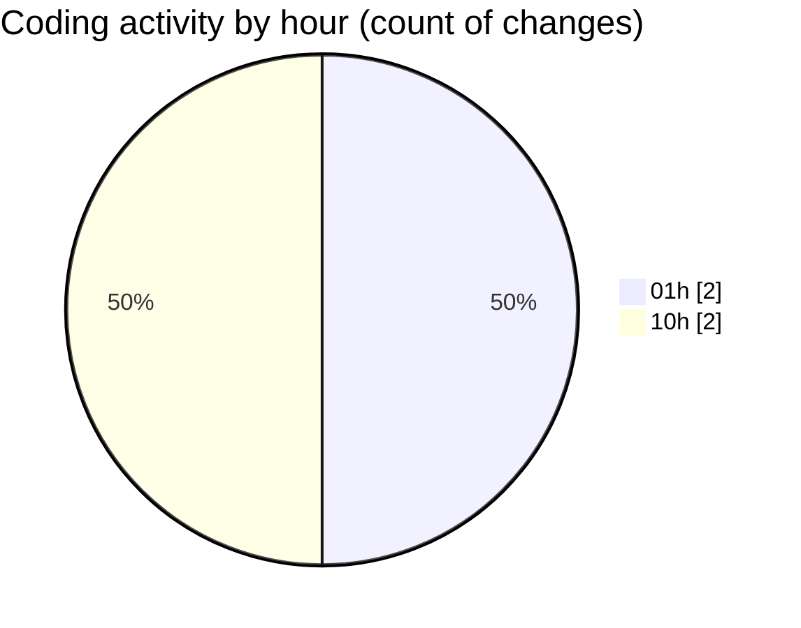

# eventscop-api-guide (Workspace) - Activity Summary 

## Overall Statistics

| Stat                   | Value                                                             |
| ---------------------- | ----------------------------------------------------------------- |
| **Lines Added** (➕)   | 138                                          |
| **Lines Removed** (➖) | 0                                        |
| **Net Change** (↕)    | 138                |
| **Active Time** (⌚)   | 3 minutes |

## Modified Files
- **routes.py** (+17, -0)
- **Supplier.py** (+121, -0)

## Visualizations

### By File Type (Lines Changed)

### By Hour (Estimated Activity Count)

> **Last Updated:** 10/17/2025, 10:25:25 AM