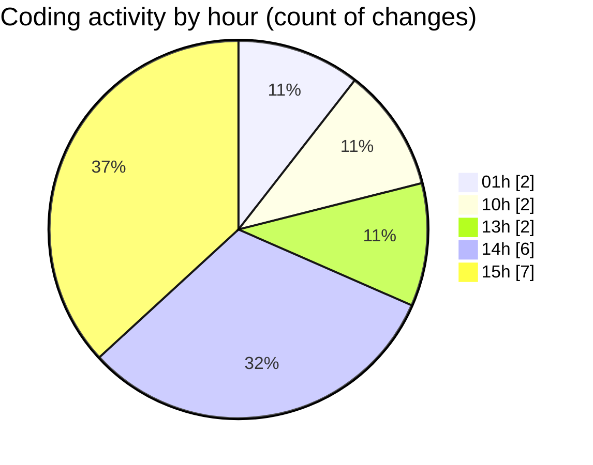

# eventscop-api-guide (Workspace) - Activity Summary 

## Overall Statistics

| Stat                   | Value                                                             |
| ---------------------- | ----------------------------------------------------------------- |
| **Lines Added** (➕)   | 371                                          |
| **Lines Removed** (➖) | 88                                        |
| **Net Change** (↕)    | 283                |
| **Active Time** (⌚)   | 19 minutes |

## Modified Files
- **routes.py** (+35, -18)
- **Supplier.py** (+132, -11)
- **schemas_base.py** (+117, -1)
- **search_engine.py** (+87, -58)

## Visualizations

### By File Type (Lines Changed)

### By Hour (Estimated Activity Count)

> **Last Updated:** 10/17/2025, 3:35:25 PM