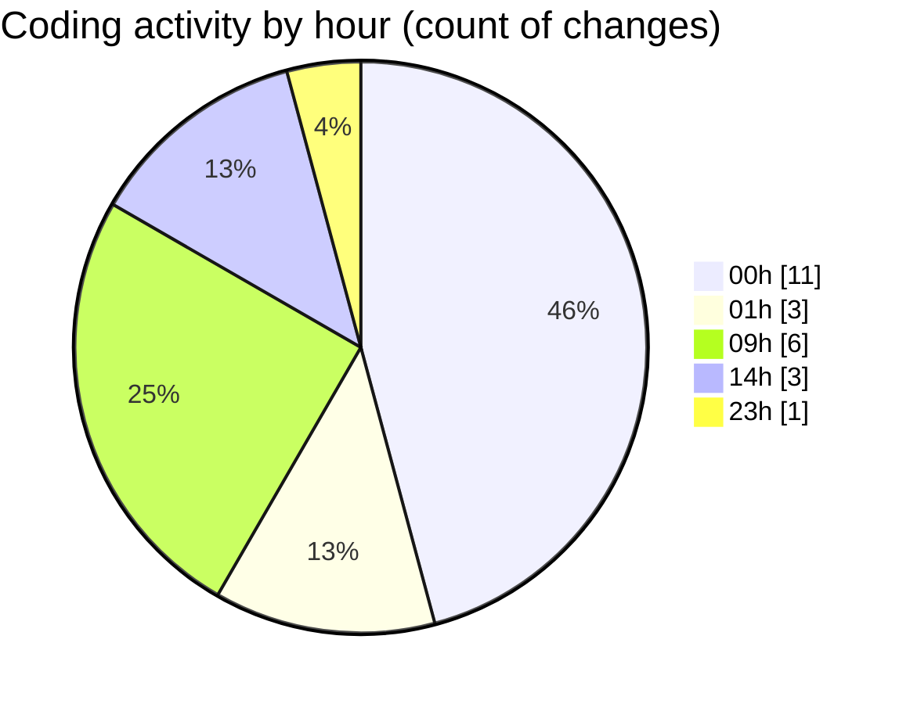

# eventscop-frontend-guide (Workspace) - Activity Summary 

## Overall Statistics

| Stat                   | Value                                                             |
| ---------------------- | ----------------------------------------------------------------- |
| **Lines Added** (➕)   | 888                                          |
| **Lines Removed** (➖) | 36                                        |
| **Net Change** (↕)    | 852                |
| **Active Time** (⌚)   | 39 minutes |

## Modified Files
- **RotatingText.tsx** (+64, -30)
- **ClientPresearchSection.tsx** (+2, -2)
- **PresearchSectionWrapper.tsx** (+20, -0)
- **Discover.tsx** (+90, -0)
- **page.tsx** (+462, -1)
- **supplier-highlights.ts** (+98, -0)
- **.gitlab-ci.yml** (+120, -3)
- **HeroSection.tsx** (+32, -0)

## Visualizations

### By File Type (Lines Changed)

### By Hour (Estimated Activity Count)

> **Last Updated:** 10/17/2025, 2:11:22 PM