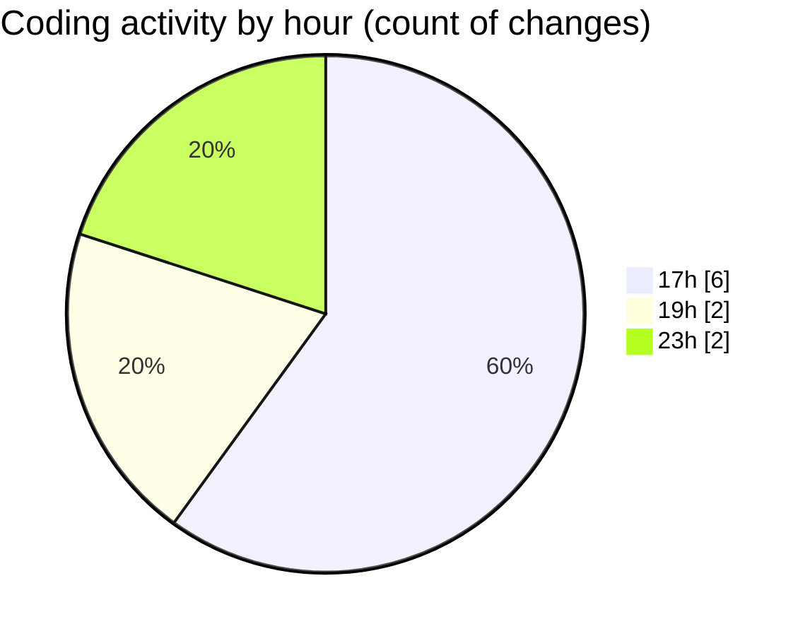

# eventscop-api-guide (Workspace) - Activity Summary 

## Overall Statistics

| Stat                   | Value                                                             |
| ---------------------- | ----------------------------------------------------------------- |
| **Lines Added** (➕)   | 37                                          |
| **Lines Removed** (➖) | 24                                        |
| **Net Change** (↕)    | 13                |
| **Active Time** (⌚)   | 10 minutes |

## Modified Files
- **search_engine.py** (+34, -24)
- **schemas_base.py** (+1, -0)
- **routes_card.py** (+2, -0)

## Visualizations

### By File Type (Lines Changed)

### By Hour (Estimated Activity Count)

> **Last Updated:** 10/20/2025, 11:10:39 PM