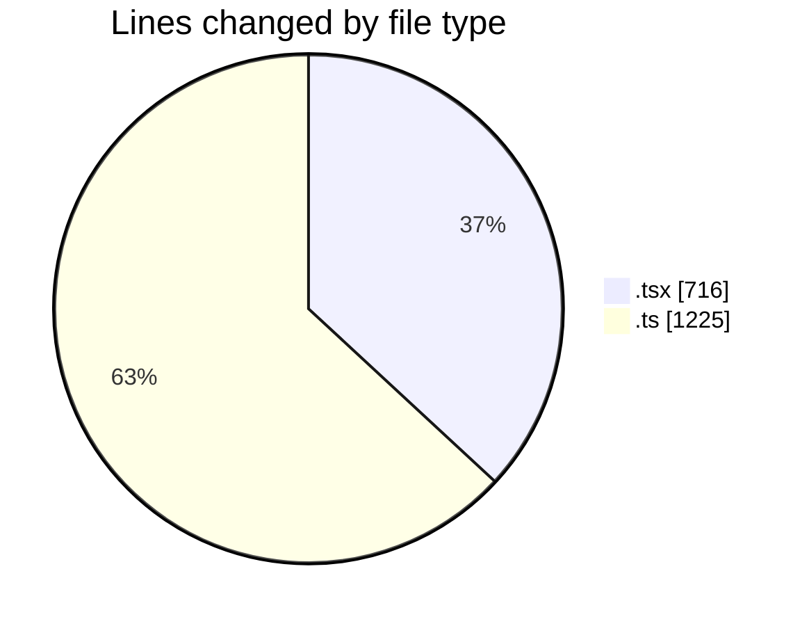
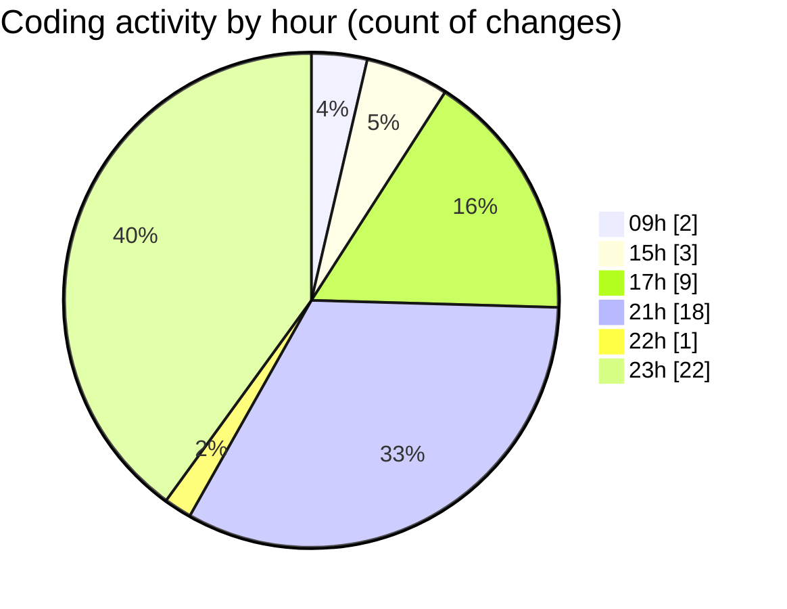

# eventscop-frontend-guide (Workspace) - Activity Summary 

## Overall Statistics

| Stat                   | Value                                                             |
| ---------------------- | ----------------------------------------------------------------- |
| **Lines Added** (➕)   | 1874                                          |
| **Lines Removed** (➖) | 67                                        |
| **Net Change** (↕)    | 1807                |
| **Active Time** (⌚)   | 59 minutes |

## Modified Files
- **RotatingText.tsx** (+18, -9)
- **page.tsx** (+2, -1)
- **HeroSection.tsx** (+45, -1)
- **suppliers.ts** (+1, -11)
- **page.tsx** (+8, -0)
- **supplier.ts** (+499, -0)
- **WelcomeSelectSteps.tsx** (+135, -0)
- **ActivityCapacityBrief.tsx** (+102, -3)
- **urls.ts** (+97, -4)
- **common.ts** (+210, -3)
- **ActivityHeroSection.tsx** (+46, -1)
- **HeroTitleBase.tsx** (+1, -1)
- **ContactButtons.tsx** (+169, -1)
- **PlaceQuoteSidebar.tsx** (+70, -2)
- **ProviderQuoteSidebar.tsx** (+72, -29)
- **place.ts** (+357, -0)
- **phone.ts** (+29, -1)
- **index.ts** (+13, -0)

## Visualizations

### By File Type (Lines Changed)

### By Hour (Estimated Activity Count)

> **Last Updated:** 10/20/2025, 11:21:36 PM