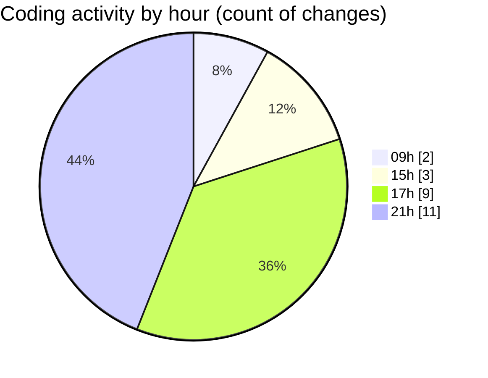

# eventscop-frontend-guide (Workspace) - Activity Summary 

## Overall Statistics

| Stat                   | Value                                                             |
| ---------------------- | ----------------------------------------------------------------- |
| **Lines Added** (➕)   | 1164                                          |
| **Lines Removed** (➖) | 25                                        |
| **Net Change** (↕)    | 1139                |
| **Active Time** (⌚)   | 29 minutes |

## Modified Files
- **RotatingText.tsx** (+18, -9)
- **page.tsx** (+2, -1)
- **HeroSection.tsx** (+45, -1)
- **suppliers.ts** (+1, -11)
- **page.tsx** (+8, -0)
- **supplier.ts** (+499, -0)
- **WelcomeSelectSteps.tsx** (+135, -0)
- **ActivityCapacityBrief.tsx** (+102, -3)
- **urls.ts** (+97, -0)
- **common.ts** (+210, -0)
- **ActivityHeroSection.tsx** (+46, -0)
- **HeroTitleBase.tsx** (+1, -0)

## Visualizations

### By File Type (Lines Changed)

### By Hour (Estimated Activity Count)

> **Last Updated:** 10/20/2025, 9:36:36 PM