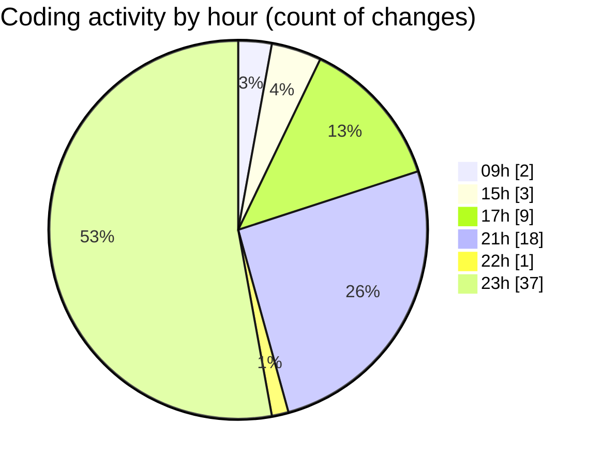

# eventscop-frontend-guide (Workspace) - Activity Summary 

## Overall Statistics

| Stat                   | Value                                                             |
| ---------------------- | ----------------------------------------------------------------- |
| **Lines Added** (➕)   | 1918                                          |
| **Lines Removed** (➖) | 105                                        |
| **Net Change** (↕)    | 1813                |
| **Active Time** (⌚)   | 68 minutes |

## Modified Files
- **RotatingText.tsx** (+18, -9)
- **page.tsx** (+2, -1)
- **HeroSection.tsx** (+45, -1)
- **suppliers.ts** (+1, -11)
- **page.tsx** (+8, -0)
- **supplier.ts** (+499, -0)
- **WelcomeSelectSteps.tsx** (+135, -0)
- **ActivityCapacityBrief.tsx** (+105, -6)
- **urls.ts** (+98, -5)
- **common.ts** (+210, -3)
- **ActivityHeroSection.tsx** (+46, -1)
- **HeroTitleBase.tsx** (+1, -1)
- **ContactButtons.tsx** (+181, -13)
- **PlaceQuoteSidebar.tsx** (+70, -2)
- **ProviderQuoteSidebar.tsx** (+86, -43)
- **place.ts** (+358, -1)
- **phone.ts** (+29, -1)
- **index.ts** (+14, -1)
- **footer.ts** (+12, -6)

## Visualizations

### By File Type (Lines Changed)

### By Hour (Estimated Activity Count)

> **Last Updated:** 10/20/2025, 11:41:36 PM