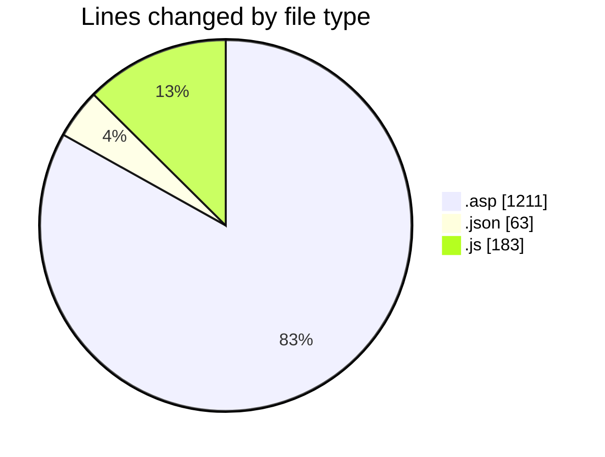
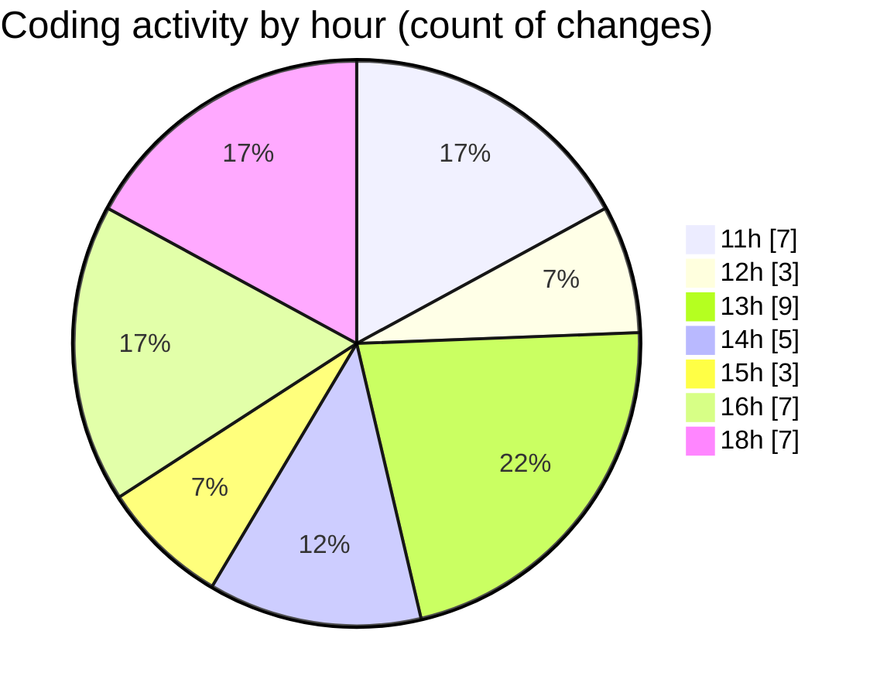

# usr.aleoudev.fr (Workspace) - Activity Summary 

## Overall Statistics

| Stat                   | Value                                                             |
| ---------------------- | ----------------------------------------------------------------- |
| **Lines Added** (➕)   | 1436                                          |
| **Lines Removed** (➖) | 21                                        |
| **Net Change** (↕)    | 1415                |
| **Active Time** (⌚)   | 55 minutes |

## Modified Files
- **cli_demande_proposition.asp** (+100, -10)
- **cli_demande_prestataire.asp** (+652, -11)
- **keybindings.json** (+63, -0)
- **cli_demande_comparateur.asp** (+438, -0)
- **comparateur_lieux.js** (+183, -0)

## Visualizations

### By File Type (Lines Changed)

### By Hour (Estimated Activity Count)

> **Last Updated:** 10/20/2025, 6:30:41 PM