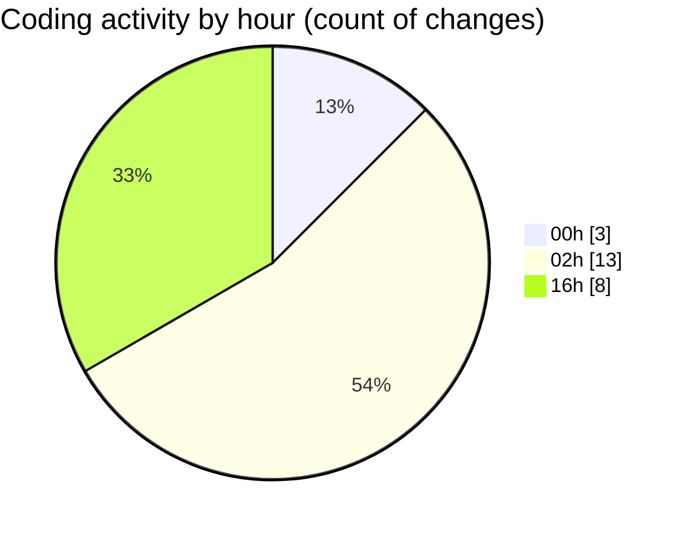

# eventscop-api-guide (Workspace) - Activity Summary 

## Overall Statistics

| Stat                   | Value                                                             |
| ---------------------- | ----------------------------------------------------------------- |
| **Lines Added** (➕)   | 1658                                          |
| **Lines Removed** (➖) | 22                                        |
| **Net Change** (↕)    | 1636                |
| **Active Time** (⌚)   | 25 minutes |

## Modified Files
- **search_engine.py** (+32, -0)
- **schemas.py** (+67, -16)
- **SupplierCustomerReview.py** (+46, -1)
- **routes.py** (+500, -5)
- **routes.py** (+960, -0)
- **SupplierChain.py** (+53, -0)

## Visualizations

### By File Type (Lines Changed)

### By Hour (Estimated Activity Count)

> **Last Updated:** 10/21/2025, 5:00:43 PM