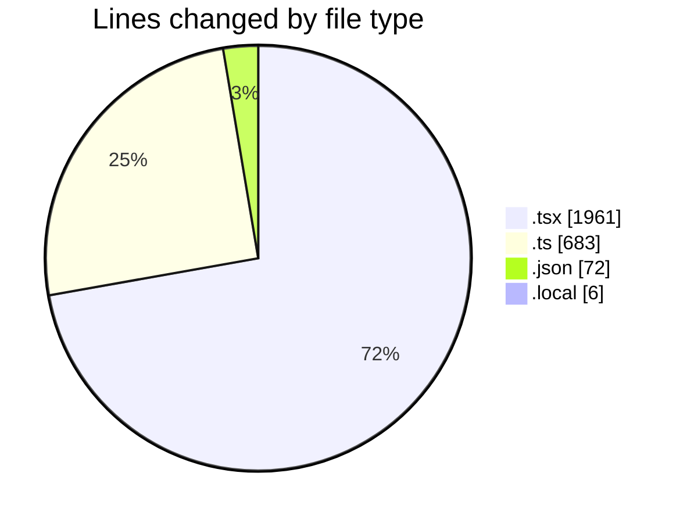
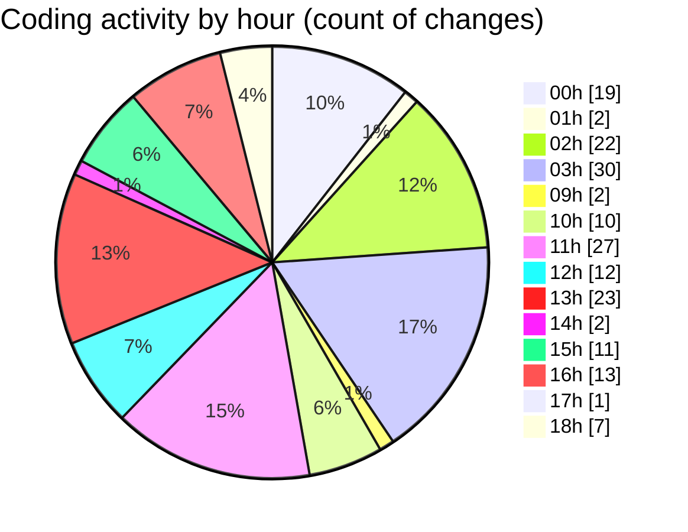

# eventscop-frontend-guide (Workspace) - Activity Summary 

## Overall Statistics

| Stat                   | Value                                                             |
| ---------------------- | ----------------------------------------------------------------- |
| **Lines Added** (➕)   | 2484                                          |
| **Lines Removed** (➖) | 238                                        |
| **Net Change** (↕)    | 2246                |
| **Active Time** (⌚)   | 233 minutes |

## Modified Files
- **page.tsx** (+49, -1)
- **SupplierInfo.tsx** (+41, -6)
- **ProviderQuoteSidebar.tsx** (+1, -0)
- **ContactButtons.tsx** (+48, -51)
- **page.tsx** (+52, -4)
- **routing.ts** (+0, -2)
- **fr.json** (+72, -0)
- **ReviewsActions.tsx** (+26, -0)
- **AddReviewModal.tsx** (+561, -9)
- **customer-review.ts** (+167, -27)
- **PropertiesSection.tsx** (+48, -17)
- **actions.ts** (+42, -0)
- **constants.ts** (+104, -0)
- **index.ts** (+46, -0)
- **place.ts** (+67, -52)
- **common.ts** (+21, -16)
- **customer-reviews.ts** (+101, -1)
- **PropertyGrid.tsx** (+78, -8)
- **PlaceCardHeader.tsx** (+46, -1)
- **PlaceCardDetails.tsx** (+103, -9)
- **AuthenticationButtons.tsx** (+51, -0)
- **ActivityCard.tsx** (+167, -3)
- **.env.local** (+1, -5)
- **BottomBar.tsx** (+48, -8)
- **BudgetField.tsx** (+43, -6)
- **PresearchResults.tsx** (+91, -0)
- **PlaceCard.tsx** (+150, -4)
- **PlaceCardImage.tsx** (+79, -1)
- **place-list.ts** (+36, -0)
- **supplier.ts** (+1, -0)
- **page.tsx** (+26, -2)
- **MapColumn.tsx** (+23, -0)
- **MapMarker.tsx** (+95, -5)

## Visualizations

### By File Type (Lines Changed)

### By Hour (Estimated Activity Count)

> **Last Updated:** 10/21/2025, 6:26:40 PM