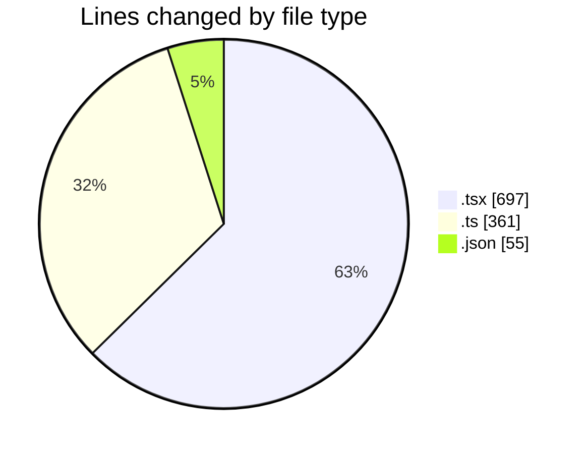
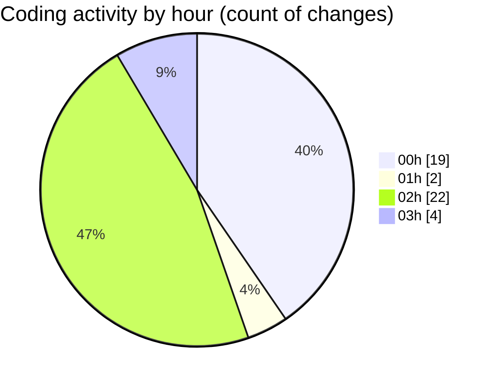

# eventscop-frontend-guide (Workspace) - Activity Summary 

## Overall Statistics

| Stat                   | Value                                                             |
| ---------------------- | ----------------------------------------------------------------- |
| **Lines Added** (➕)   | 1094                                          |
| **Lines Removed** (➖) | 19                                        |
| **Net Change** (↕)    | 1075                |
| **Active Time** (⌚)   | 67 minutes |

## Modified Files
- **page.tsx** (+49, -1)
- **SupplierInfo.tsx** (+41, -0)
- **ProviderQuoteSidebar.tsx** (+1, -0)
- **ContactButtons.tsx** (+8, -10)
- **page.tsx** (+50, -0)
- **routing.ts** (+0, -2)
- **fr.json** (+55, -0)
- **ReviewsActions.tsx** (+26, -0)
- **AddReviewModal.tsx** (+474, -4)
- **customer-review.ts** (+147, -1)
- **PropertiesSection.tsx** (+32, -1)
- **actions.ts** (+42, -0)
- **constants.ts** (+104, -0)
- **index.ts** (+46, -0)
- **place.ts** (+19, -0)

## Visualizations

### By File Type (Lines Changed)

### By Hour (Estimated Activity Count)

> **Last Updated:** 10/21/2025, 3:06:36 AM