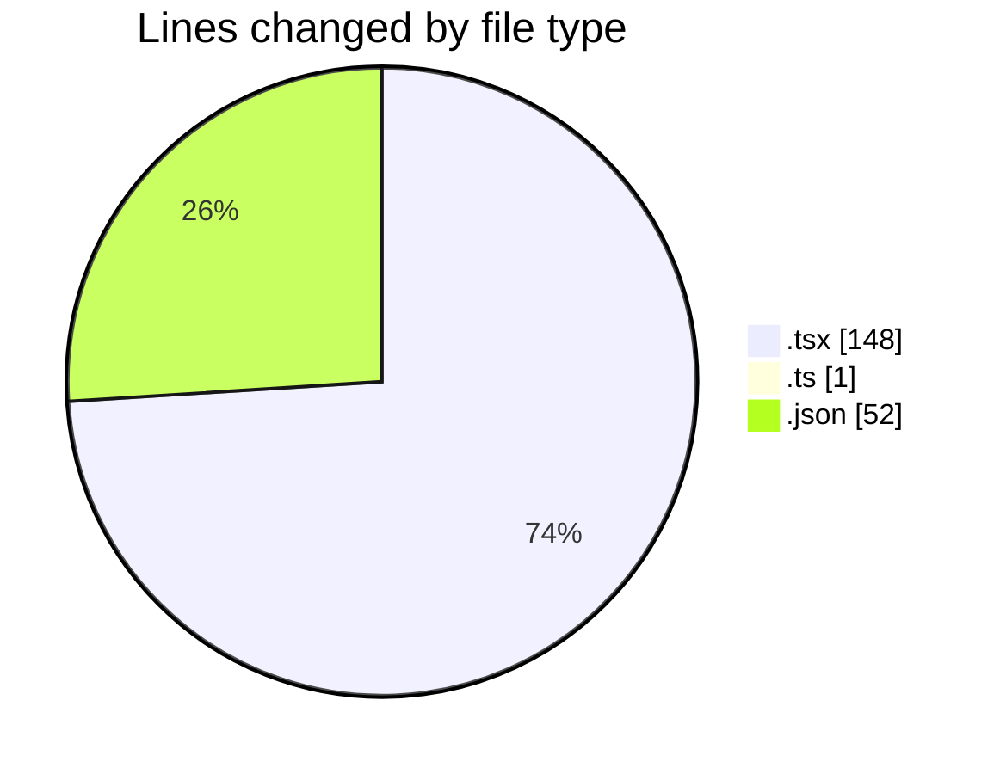

# eventscop-frontend-guide (Workspace) - Activity Summary 

## Overall Statistics

| Stat                   | Value                                                             |
| ---------------------- | ----------------------------------------------------------------- |
| **Lines Added** (➕)   | 199                                          |
| **Lines Removed** (➖) | 2                                        |
| **Net Change** (↕)    | 197                |
| **Active Time** (⌚)   | 29 minutes |

## Modified Files
- **page.tsx** (+49, -1)
- **SupplierInfo.tsx** (+41, -0)
- **ProviderQuoteSidebar.tsx** (+1, -0)
- **ContactButtons.tsx** (+6, -0)
- **page.tsx** (+50, -0)
- **routing.ts** (+0, -1)
- **fr.json** (+52, -0)

## Visualizations

### By File Type (Lines Changed)

### By Hour (Estimated Activity Count)

> **Last Updated:** 10/21/2025, 12:41:36 AM