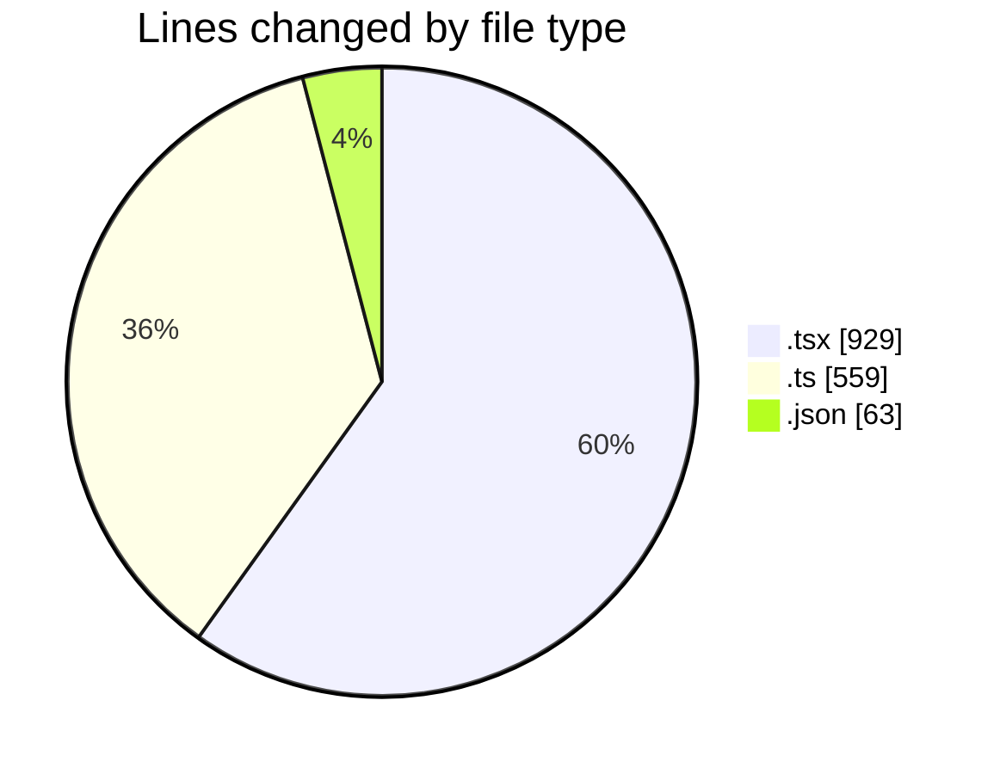
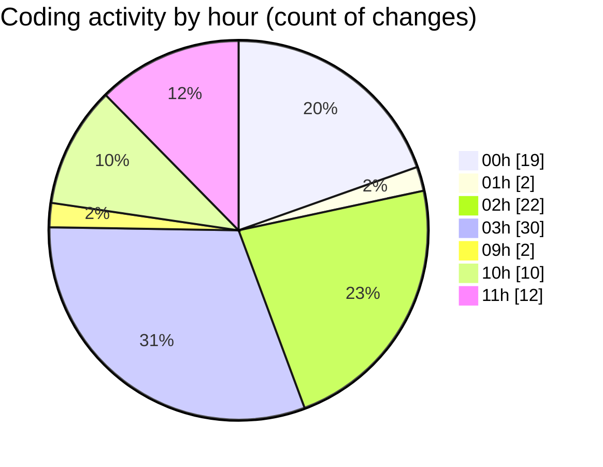

# eventscop-frontend-guide (Workspace) - Activity Summary 

## Overall Statistics

| Stat                   | Value                                                             |
| ---------------------- | ----------------------------------------------------------------- |
| **Lines Added** (➕)   | 1438                                          |
| **Lines Removed** (➖) | 113                                        |
| **Net Change** (↕)    | 1325                |
| **Active Time** (⌚)   | 114 minutes |

## Modified Files
- **page.tsx** (+49, -1)
- **SupplierInfo.tsx** (+41, -6)
- **ProviderQuoteSidebar.tsx** (+1, -0)
- **ContactButtons.tsx** (+22, -25)
- **page.tsx** (+52, -4)
- **routing.ts** (+0, -2)
- **fr.json** (+63, -0)
- **ReviewsActions.tsx** (+26, -0)
- **AddReviewModal.tsx** (+561, -9)
- **customer-review.ts** (+167, -27)
- **PropertiesSection.tsx** (+42, -10)
- **actions.ts** (+42, -0)
- **constants.ts** (+104, -0)
- **index.ts** (+46, -0)
- **place.ts** (+36, -20)
- **common.ts** (+9, -4)
- **customer-reviews.ts** (+101, -1)
- **PropertyGrid.tsx** (+76, -4)

## Visualizations

### By File Type (Lines Changed)

### By Hour (Estimated Activity Count)

> **Last Updated:** 10/21/2025, 11:11:39 AM