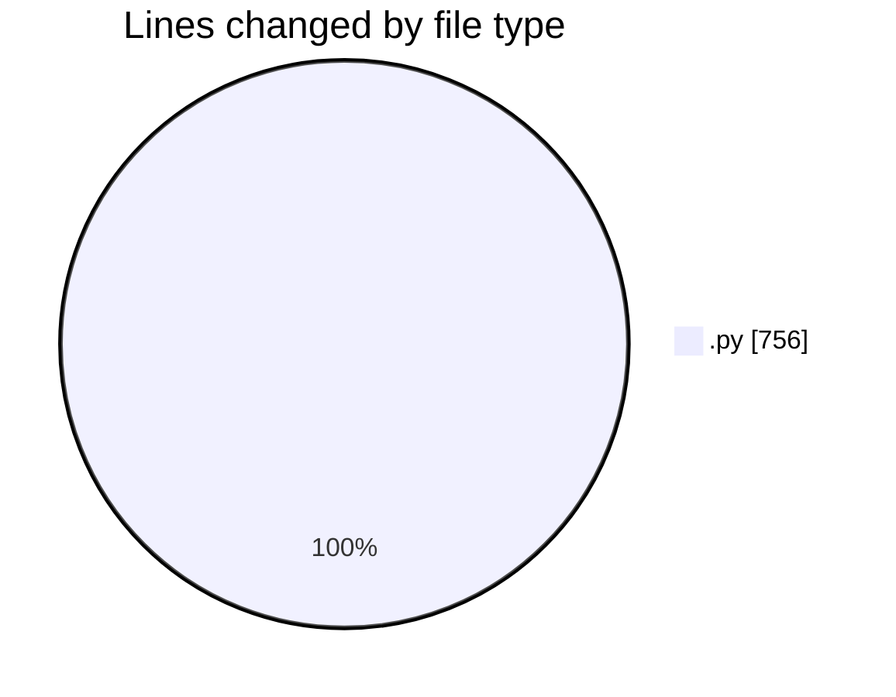
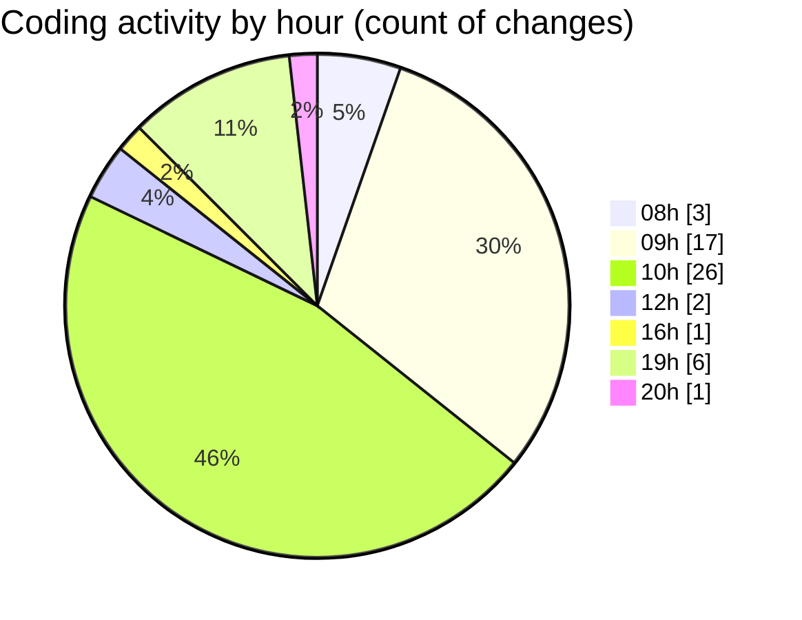

# eventscop-api-guide (Workspace) - Activity Summary 

## Overall Statistics

| Stat                   | Value                                                             |
| ---------------------- | ----------------------------------------------------------------- |
| **Lines Added** (➕)   | 629                                          |
| **Lines Removed** (➖) | 127                                        |
| **Net Change** (↕)    | 502                |
| **Active Time** (⌚)   | 68 minutes |

## Modified Files
- **schemas.py** (+27, -0)
- **routes.py** (+186, -0)
- **RseLabel.py** (+3, -1)
- **964fca6600a1_add_rse_label_languages.py** (+7, -0)
- **c20b6eb7621b_add_rse_label_languages.py** (+76, -0)
- **routes.py** (+66, -106)
- **SupplierChain.py** (+8, -7)
- **SupplierChainRseLabel.py** (+47, -7)
- **9b82a5272b65_fix_supplier_chain_rse_labels_.py** (+44, -0)
- **test_cartesian.py** (+35, -0)
- **test_recursion.py** (+82, -0)
- **schemas.py** (+43, -0)
- **routes.py** (+1, -1)
- **main.py** (+4, -0)
- **search_engine.py** (+0, -5)

## Visualizations

### By File Type (Lines Changed)

### By Hour (Estimated Activity Count)

> **Last Updated:** 10/22/2025, 8:05:45 PM