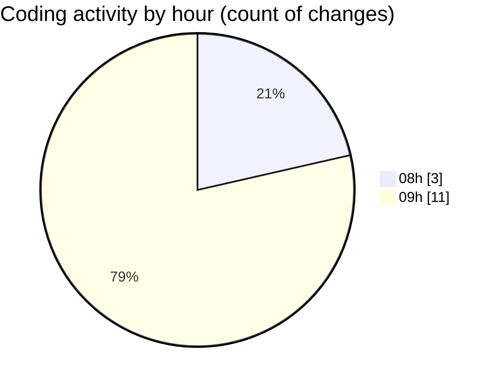

# eventscop-api-guide (Workspace) - Activity Summary 

## Overall Statistics

| Stat                   | Value                                                             |
| ---------------------- | ----------------------------------------------------------------- |
| **Lines Added** (➕)   | 294                                          |
| **Lines Removed** (➖) | 1                                        |
| **Net Change** (↕)    | 293                |
| **Active Time** (⌚)   | 18 minutes |

## Modified Files
- **schemas.py** (+27, -0)
- **routes.py** (+180, -0)
- **RseLabel.py** (+3, -1)
- **964fca6600a1_add_rse_label_languages.py** (+7, -0)
- **c20b6eb7621b_add_rse_label_languages.py** (+76, -0)
- **routes.py** (+1, -0)

## Visualizations

### By File Type (Lines Changed)

### By Hour (Estimated Activity Count)

> **Last Updated:** 10/22/2025, 9:40:44 AM