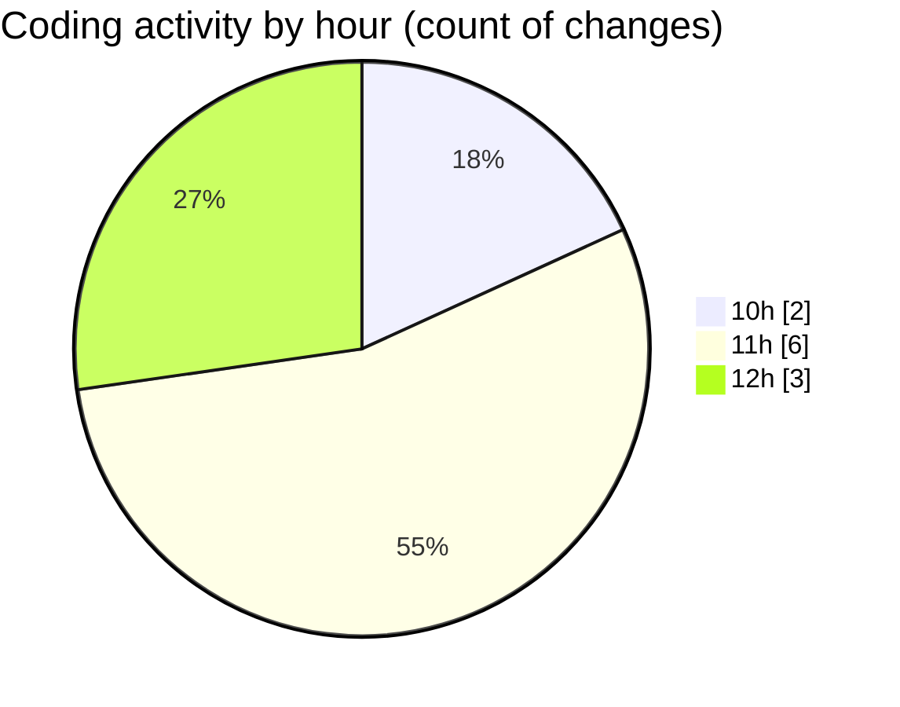

# eventscop-frontend-guide (Workspace) - Activity Summary 

## Overall Statistics

| Stat                   | Value                                                             |
| ---------------------- | ----------------------------------------------------------------- |
| **Lines Added** (➕)   | 127                                          |
| **Lines Removed** (➖) | 17                                        |
| **Net Change** (↕)    | 110                |
| **Active Time** (⌚)   | 20 minutes |

## Modified Files
- **supplier.ts** (+10, -1)
- **suppliers.ts** (+1, -16)
- **page.tsx** (+31, -0)
- **rse.ts** (+85, -0)

## Visualizations

### By File Type (Lines Changed)

### By Hour (Estimated Activity Count)

> **Last Updated:** 10/22/2025, 12:11:41 PM