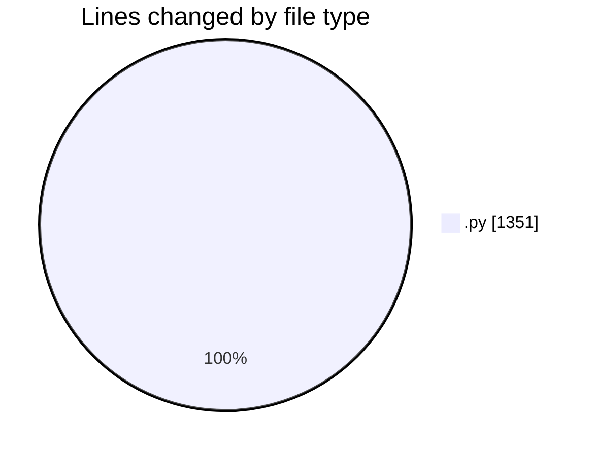
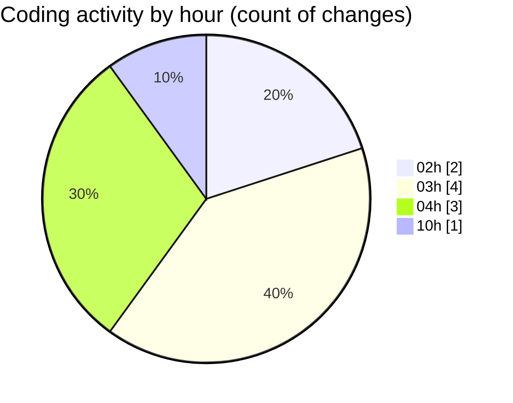

# eventscop-api-guide (Workspace) - Activity Summary 

## Overall Statistics

| Stat                   | Value                                                             |
| ---------------------- | ----------------------------------------------------------------- |
| **Lines Added** (➕)   | 1350                                          |
| **Lines Removed** (➖) | 1                                        |
| **Net Change** (↕)    | 1349                |
| **Active Time** (⌚)   | 12 minutes |

## Modified Files
- **routes.py** (+256, -0)
- **routes.py** (+559, -0)
- **supplier_counter.py** (+535, -1)

## Visualizations

### By File Type (Lines Changed)

### By Hour (Estimated Activity Count)

> **Last Updated:** 10/23/2025, 10:37:48 AM