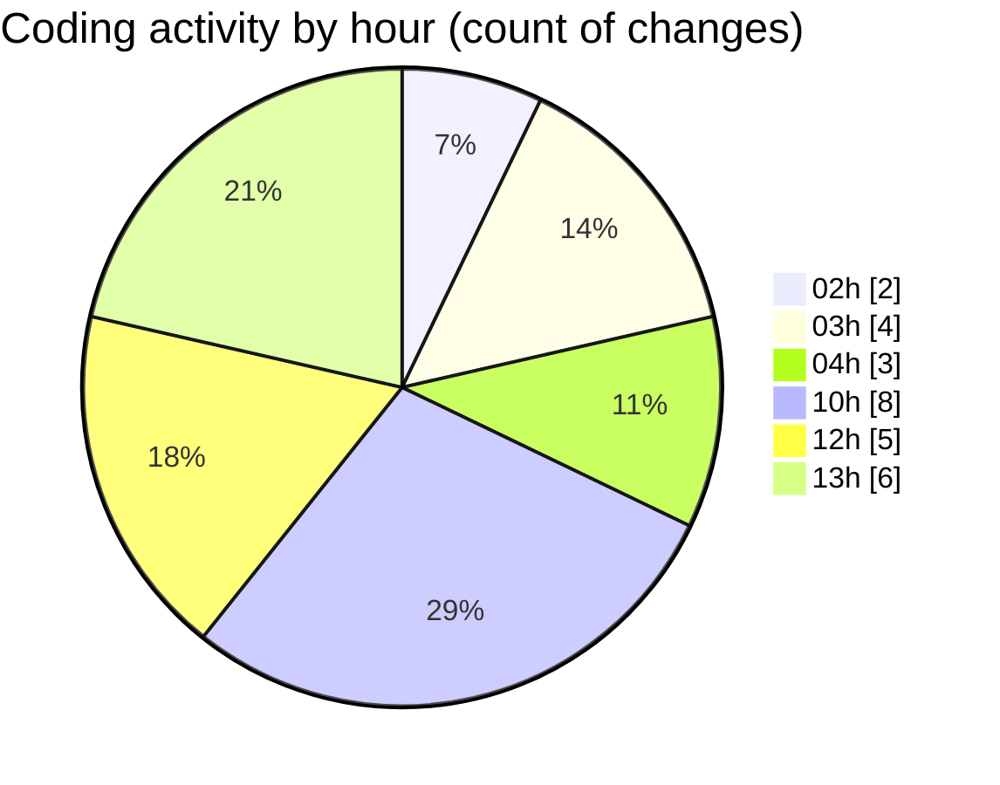

# eventscop-api-guide (Workspace) - Activity Summary 

## Overall Statistics

| Stat                   | Value                                                             |
| ---------------------- | ----------------------------------------------------------------- |
| **Lines Added** (➕)   | 2504                                          |
| **Lines Removed** (➖) | 5                                        |
| **Net Change** (↕)    | 2499                |
| **Active Time** (⌚)   | 37 minutes |

## Modified Files
- **routes.py** (+520, -0)
- **routes.py** (+1161, -3)
- **supplier_counter.py** (+562, -2)
- **routes.py** (+261, -0)

## Visualizations

### By File Type (Lines Changed)

### By Hour (Estimated Activity Count)

> **Last Updated:** 10/23/2025, 1:47:48 PM