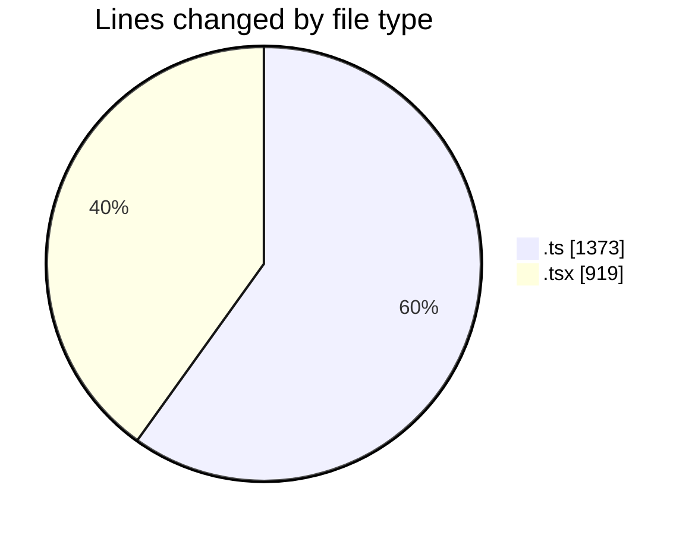
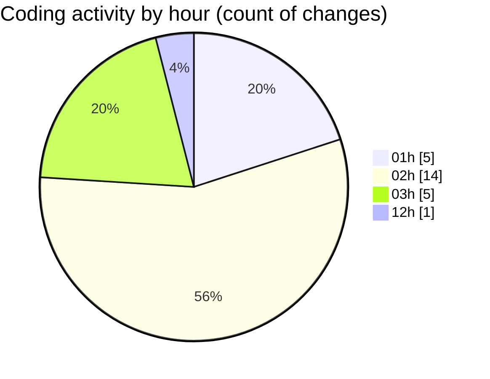

# eventscop-frontend-guide (Workspace) - Activity Summary 

## Overall Statistics

| Stat                   | Value                                                             |
| ---------------------- | ----------------------------------------------------------------- |
| **Lines Added** (➕)   | 2267                                          |
| **Lines Removed** (➖) | 25                                        |
| **Net Change** (↕)    | 2242                |
| **Active Time** (⌚)   | 31 minutes |

## Modified Files
- **pages.ts** (+302, -8)
- **page.tsx** (+257, -1)
- **suppliers.ts** (+530, -15)
- **CityInputWithRadius.tsx** (+195, -0)
- **dynamic.ts** (+348, -0)
- **page.tsx** (+303, -1)
- **types.ts** (+170, -0)
- **FooterSection.tsx** (+34, -0)
- **FooterContact.tsx** (+33, -0)
- **page.tsx** (+95, -0)

## Visualizations

### By File Type (Lines Changed)

### By Hour (Estimated Activity Count)

> **Last Updated:** 10/23/2025, 12:50:46 PM